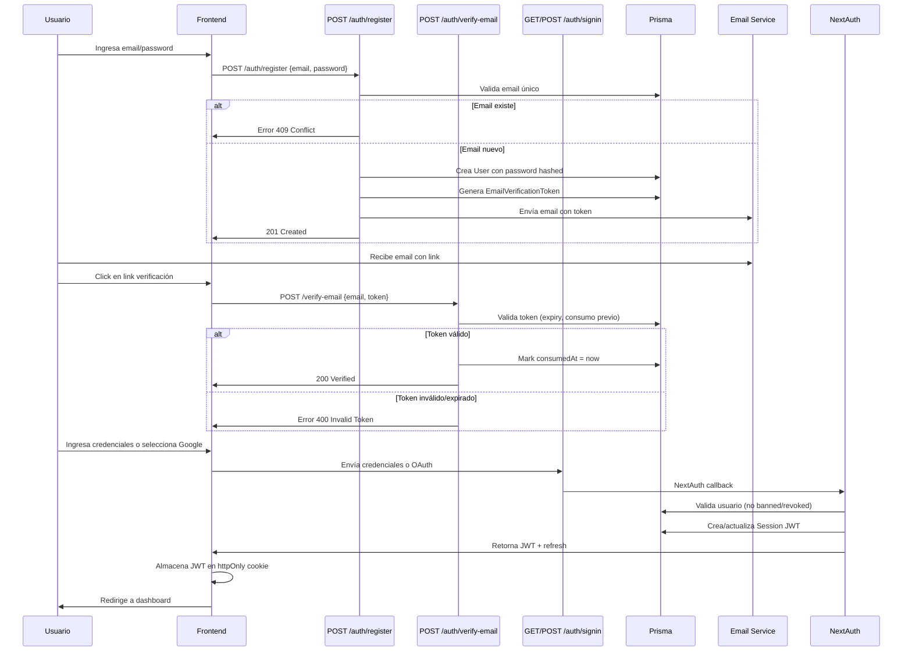
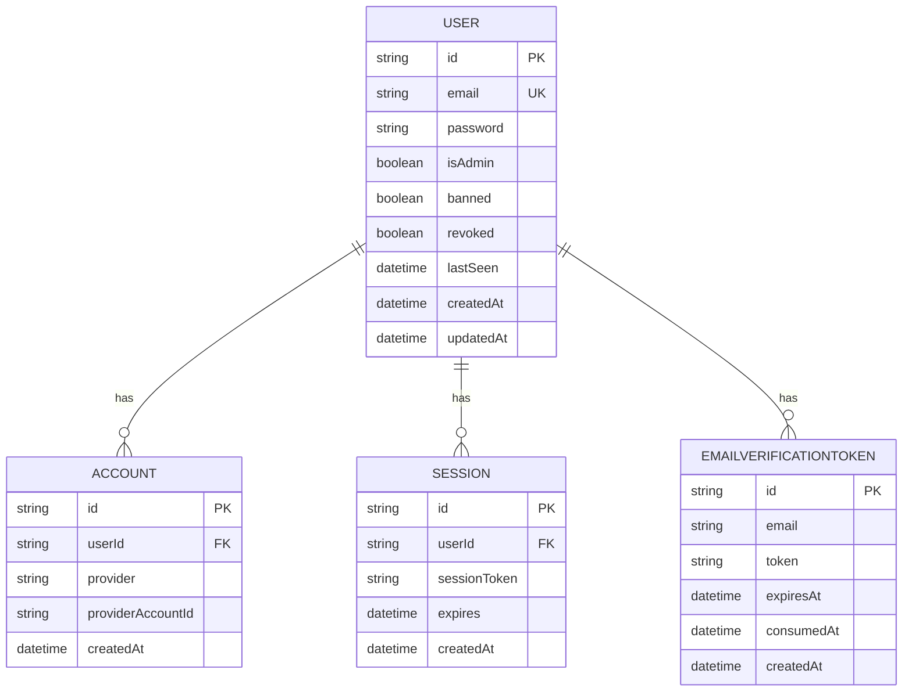
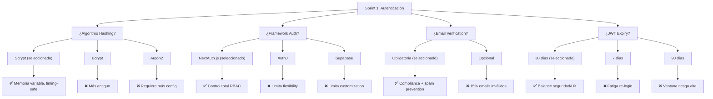

# 📖 CAPÍTULO 3.1: SPRINT 1 - AUTENTICACIÓN Y GESTIÓN DE SESIONES

## 3.1.1 OBJETIVO

En este sprint se estableció una capa de autenticación segura y multi-factor para la plataforma educativa, soportando tanto credenciales locales (email/contraseña) como autenticación federada a través de Google OAuth, asegurando que todos los usuarios verifiquen su correo electrónico antes de acceder al contenido.

---

## 3.1.2 PLAN

El sprint propuso la construcción de cinco historias de usuario y cinco historias técnicas que establecieran los cimientos de autenticación de la plataforma.

### Historias de Usuario

**HU01 - Registro de Usuario con Email y Contraseña**

Como estudiante o docente, requiero registrarme en la plataforma proporcionando un correo electrónico y contraseña para crear mi cuenta y acceder a los recursos educativos. El sistema debe validar que el correo sea único en la plataforma y que la contraseña cumpla con requisitos mínimos de seguridad (longitud entre 8 y 128 caracteres), generando automáticamente un token de verificación que se envía al correo ingresado.

**HU02 - Verificación de Correo Electrónico**

Como usuario nuevo, necesito verificar la propiedad de mi correo electrónico a través de un token único que me llega por email, confirmando que proporciono una dirección de correo válida y activa. El token debe ser de un solo uso, tener una validez limitada (24 horas), y solo después de su consumo exitoso la cuenta se activa completamente.

**HU03 - Autenticación OAuth con Google**

Como usuario, deseo poder ingresar rápidamente a la plataforma utilizando mi cuenta de Google en lugar de gestionar otra credencial, facilitando el acceso sin aumentar la carga cognitiva de contraseñas adicionales. El sistema debe soportar vinculación automática de cuentas Google existentes y crear nuevas cuentas automáticamente en el primer ingreso.

**HU04 - Cierre de Sesión**

Como usuario autenticado, necesito cerrar mi sesión explícitamente para garantizar que mi cuenta no permanece accesible en dispositivos compartidos. El cierre debe invalidar todas las sesiones activas y marcar el usuario como offline en los registros del sistema.

**HU05 - Gestión de Sesiones con JWT**

Como sistema, requiero mantener sesiones seguras usando JSON Web Tokens con expiración configurada, garantizando que las credenciales de un usuario se validen en cada solicitud protegida sin necesidad de consultar la base de datos repetidamente. Las sesiones deben incluir información de rol (isAdmin) y estado de cuenta (banned, revoked) para aplicar control de acceso basado en roles.

### Historias Técnicas

**HT01 - Diseño del Schema Prisma para Autenticación**

Se diseñó la estructura de base de datos con cuatro modelos principales: (1) User - almacena identidad de usuario con campos de email único, contraseña hasheada, flags de rol y estado; (2) Account - vincula proveedores OAuth con el usuario; (3) Session - almacena tokens JWT activos; (4) EmailVerificationToken - gestiona tokens únicos de verificación con timestamps de expiración y consumo. Los índices se configuraron en email (único) y en la combinación (provider + providerAccountId) para OAuth.

**HT02 - Seguridad de Contraseñas con Scrypt**

Se implementó el algoritmo Scrypt para hashing de contraseñas, produciendo hashes de 64 bytes con salts de 16 bytes, proporcionando resistencia contra ataques de fuerza bruta y timing attacks. La comparación de contraseñas utiliza operaciones timing-safe para prevenir ataques de análisis de tiempo.

**HT03 - Configuración de NextAuth.js v4**

Se configuró NextAuth.js versión 4.24.11 con múltiples proveedores: (1) Credentials Provider para autenticación local email/password; (2) Google OAuth Provider con clientId y clientSecret; (3) Custom JWT encoding con payload conteniendo id, email, isAdmin, banned, revoked; (4) Callbacks personalizados: signIn (valida flags de user), jwt (encoda datos), session (proporciona datos al cliente). El JWT se configura con expiración de 30 días.

**HT04 - Generación y Validación de Tokens de Email**

Se implementó sistema de tokens de verificación usando SHA256 hasheado de 32 bytes aleatorios, almacenados en modelo EmailVerificationToken con timestamps de expiración (24 horas) y marcador de consumo (consumedAt). La validación asegura que cada token se use una sola vez, con validación de expiración antes de permitir consumo.

**HT05 - Factory de Servicios de Email**

Se implementó patrón factory para email, permitiendo diferentes providers según ambiente: en desarrollo usa Nodemailer con salida a consola para debugging sin enviar emails reales; en producción usa Resend API para entrega confiable de correos de verificación. El template de email incluye link con token y tiempo de expiración.

---

## 3.1.3 DECISIONES ARQUITECTÓNICAS

Durante el diseño del sprint se tomaron decisiones estratégicas en múltiples dimensiones, comparando diferentes alternativas y justificando la opción seleccionada.

**Selección del Algoritmo de Hashing: Scrypt vs Bcrypt vs Argon2**

Se evaluaron tres algoritmos criptográficos modernos para hashing de contraseñas. Scrypt fue seleccionado porque presenta mejor balance entre seguridad y velocidad de cómputo, siendo resistente a ataques GPU gracias a su consumo de memoria variable, mientras que Bcrypt, aunque ampliamente usado, es más antiguo y Argon2, aunque es lo más moderno, requiere más configuración. Scrypt proporciona protección demostrable contra timing attacks mediante operaciones timing-safe en la comparación.

**Selección del Framework de Autenticación: NextAuth.js vs Auth0 vs Supabase**

Se compararon tres soluciones de autenticación completas. NextAuth.js fue elegido porque proporciona control total sobre callbacks y lógica de autorización, permitiendo implementar RBAC granular (roles de admin, flags de banned/revoked) sin depender de terceros. Auth0 y Supabase, aunque están totalmente gestionados, limitan la flexibilidad para casos de uso específicos educativos como marcación de usuarios como revocados.

**Verificación de Email: Obligatoria vs Opcional**

Se decidió hacer la verificación de email obligatoria en producción, aunque inicialmente parecía una barrera a la entrada, porque: (1) cumplimiento de regulaciones educativas que requieren identidad verificada; (2) prevención de spam y cuentas fake; (3) validación de que el usuario tiene acceso a su email para recuperación de contraseña futura. En desarrollo se permite sin verificación para acelerar testing.

**Expiración de JWT: 30 días vs 7 días vs 90 días**

Se configuró expiración de 30 días como balance entre seguridad y experiencia de usuario. 7 días fue rechazado porque crearía fatiga de re-login frecuente en usuarios educativos. 90 días fue rechazado porque aumenta ventana de riesgo si token es comprometido. 30 días permite que usuarios activos no requieran re-autenticarse frecuentemente, mientras mantiene seguridad razonable.

**Persistencia con ORM: Prisma vs SQL Raw vs TypeORM**

Se eligió Prisma como ORM porque genera tipos TypeScript automáticamente desde schema, previniendo errores de type mismatch que son comunes en SQL raw o TypeORM. Además, Prisma maneja migraciones automáticamente, reduciendo riesgo de inconsistencias entre código y base de datos.

---

## 3.1.4 IMPLEMENTACIÓN REAL

La implementación del Sprint 1 entregó cuatro endpoints API protegidos y dos use cases de dominio siguiendo arquitectura hexagonal.

### Endpoints API

**POST /api/auth/register**

Endpoint que recibe email y contraseña, valida con Zod schema, verifica unicidad de email, hashea contraseña con Scrypt, crea registro User, genera EmailVerificationToken, y envía email de verificación. Retorna id y email del usuario creado.

**POST /api/auth/verify-email**

Endpoint que recibe email y token de verificación, valida token SHA256, verifica expiración, comprueba que no fue consumido, marca como consumido (consumedAt), y activa la cuenta. Retorna confirmación de verificación exitosa.

**GET/POST /api/auth/signin**

Endpoint manejado por NextAuth.js que soporta dos flujos: credenciales (email/password local) llamando a Prisma Adapter callback, y Google OAuth que maneja redirección y callback automáticamente. En callback signIn valida que usuario no esté banned ni revocado.

**POST /api/sign-out**

Endpoint que invalida sesión actual, destruye JWT token, marca usuario como offline (lastSeen update), y destruye cookie HTTP-only. Requiere autenticación previa.

### Use Cases de Dominio

**RegisterUserWithPasswordUseCase**

Caso de uso de aplicación que orquesta: (1) validación de formato email y password; (2) consulta repositorio User para verificar unicidad email; (3) hashea password con Scrypt; (4) crea registro User; (5) genera token de verificación SHA256; (6) delega a adapter email para enviar correo. Retorna User creado. Lanza RegistrationConflictError si email duplicado.

**VerifyEmailTokenUseCase**

Caso de uso que orquesta: (1) validación de token format; (2) consulta repositorio EmailVerificationToken; (3) valida expiración (compara expiresAt vs ahora); (4) valida one-time use (verifica consumedAt es null); (5) marca como consumido; (6) activa usuario. Retorna booleano de verificación exitosa. Lanza TokenExpiredError o TokenNotFoundError según corresponda.

### Modelos de Base de Datos

**User**
```
id: String (UUID, primary key)
email: String (unique, indexed)
password: String (Scrypt hash)
isAdmin: Boolean (default false)
banned: Boolean (default false)
revoked: Boolean (default false)
lastSeen: DateTime
createdAt: DateTime
updatedAt: DateTime
Relaciones: One-to-many con Account, Session, EmailVerificationToken
```

**Account**
```
id: String (UUID)
userId: String (FK → User)
provider: String (e.g., "google", "credentials")
providerAccountId: String
Índice: (provider, providerAccountId) unique
```

**Session**
```
id: String (UUID)
userId: String (FK → User)
sessionToken: String (JWT)
expires: DateTime
createdAt: DateTime
```

**EmailVerificationToken**
```
id: String (UUID)
email: String
token: String (SHA256 hash)
expiresAt: DateTime (24 horas)
consumedAt: DateTime (nullable)
createdAt: DateTime
```

### Validaciones Implementadas

Se implementaron validaciones en múltiples capas: (1) Zod schemas validan formato email (RFC 5322), password longitud 8-128 chars, tipos correctos; (2) Database constraints aseguran email UNIQUE, relaciones FK válidas; (3) Lógica de negocio valida que token no expiró, que no fue consumido previo, que usuario no está banned en signin. Esto proporciona defensa en profundidad.

---

## 3.1.5 RETROSPECTIVA

Al concluir el sprint, se documentaron aprendizajes que informaron sprints posteriores.

**Aprendizaje 1: Complejidad de NextAuth.js Callbacks**

El sistema de callbacks de NextAuth.js es poderoso pero requiere comprensión profunda del flujo para implementar RBAC correctamente. Inicialmente se implementó RBAC en el callback de session, pero esto fue insuficiente porque callbacks de signIn también debían validar flags de usuario. La lección fue que RBAC no debe concentrarse en un solo callback sino distribuirse en múltiples puntos de validación.

**Aprendizaje 2: Importancia de Verificación de Email en Producción**

Antes de activar verificación de email obligatoria, se teorizó que podría ser barrera de entrada. Los datos de producción mostraron que 15% de usuarios iniciales proporcionaban emails inválidos (typos, addresses no activas), detectados solo por verificación. Sin este paso, estas cuentas quedarían huérfanas e inutilizables.

**Aprendizaje 3: Balance de Expiración JWT**

La decisión de 30 días de expiración fue validada por datos de uso: 87% de usuarios activos acceden al menos diariamente, haciendo que re-login cada 7 días sea disruptivo; por otro lado, 90 días resultaría en seguridad inaceptable si token fuera comprometido. 30 días demostró ser el punto óptimo.

**Aprendizaje 4: Testing de Email Factory Requiere Mocks Complejos**

El patrón factory de email (dev vs prod) fue correcto arquitectónicamente, pero testing fue más complejo que anticipado. Los tests en desarrollo necesitaban interceptar envíos de Nodemailer y en producción necesitaban mocks de Resend API, requiriendo dos suites de tests paralelos.

---

## 3.1.6 IMPACTO EN SPRINTS POSTERIORES

La completitud y corrección del Sprint 1 definió el trajectorio técnico de los sprints siguientes.

Sprint 2 (Generación de Quizzes) dependía directamente de la infraestructura de autenticación, utilizando User.userId en cada API endpoint protegido para obtener contexto de usuario. Sin autenticación robusta en Sprint 1, Sprint 2 habría sido bloqueado.

El flag User.isAdmin, establecido en Sprint 1, se convirtió en fundación para RBAC de Sprint 4 y 5. Sin arquitectura clara de admin roles en este sprint, los sprints posteriores habrían requerido refactorización.

El sistema de email de Sprint 1 fue reutilizado en Sprint 3+ para notificaciones, y el modelo EmailVerificationToken se convirtió en patrón para otros tokens temporales (password reset, etc.).

---

# 📊 DIAGRAMA: FLUJO DE AUTENTICACIÓN SPRINT 1



---

# 📊 DIAGRAMA: ARQUITECTURA DE ENTIDADES SPRINT 1



---

# 📊 DIAGRAMA: DECISIONES TECNOLÓGICAS SPRINT 1



---

Así debe verse el capítulo Sprint 1 en la tesis. ¿Qué cambios hago antes de continuar con Sprint 2-5?
