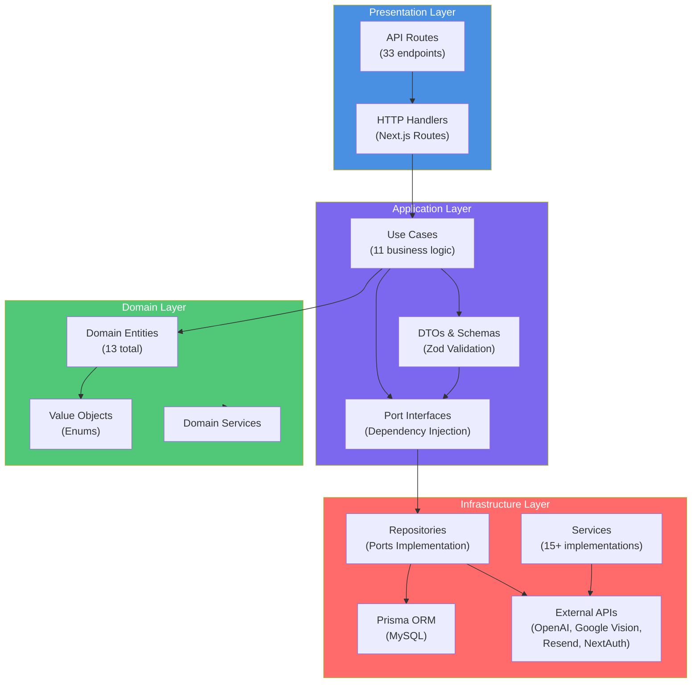
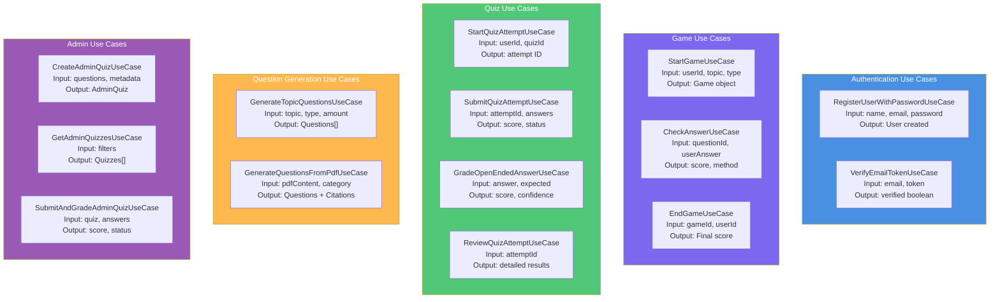
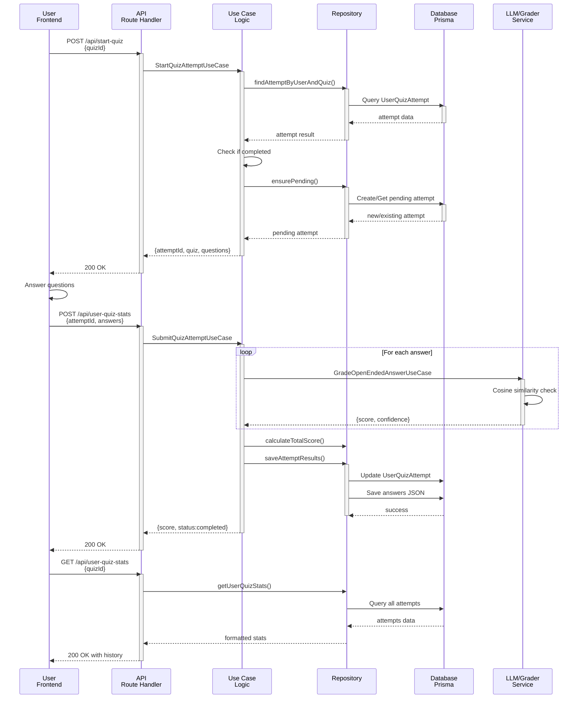
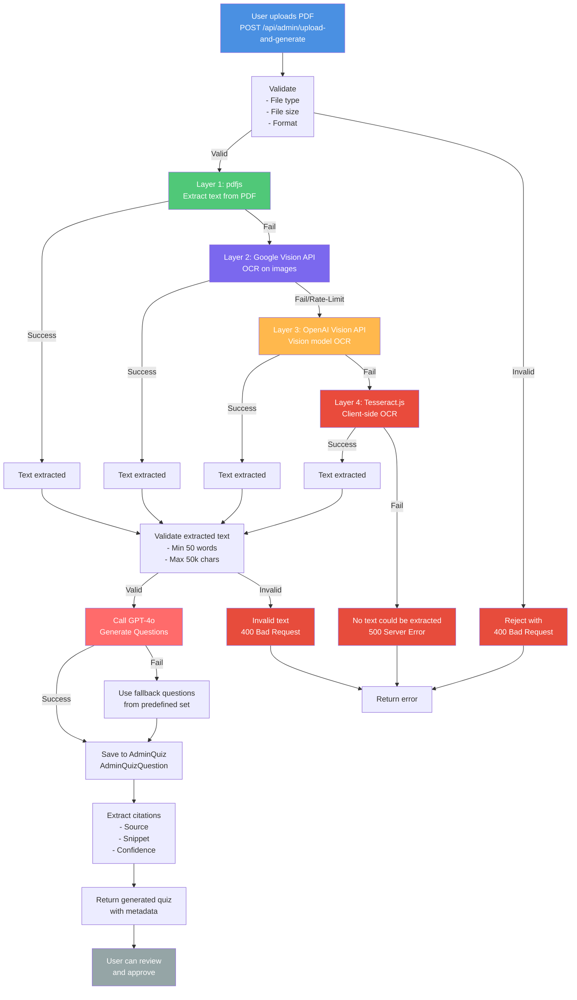
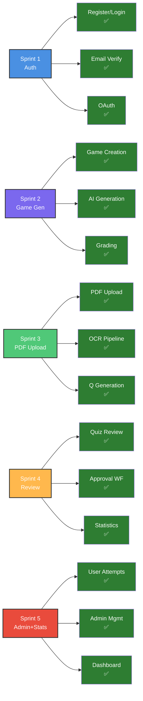
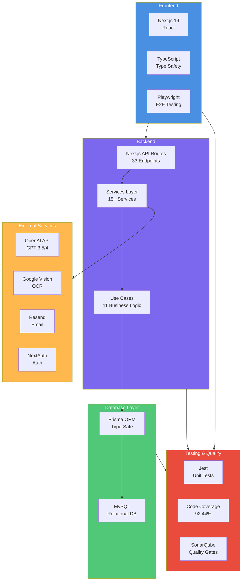
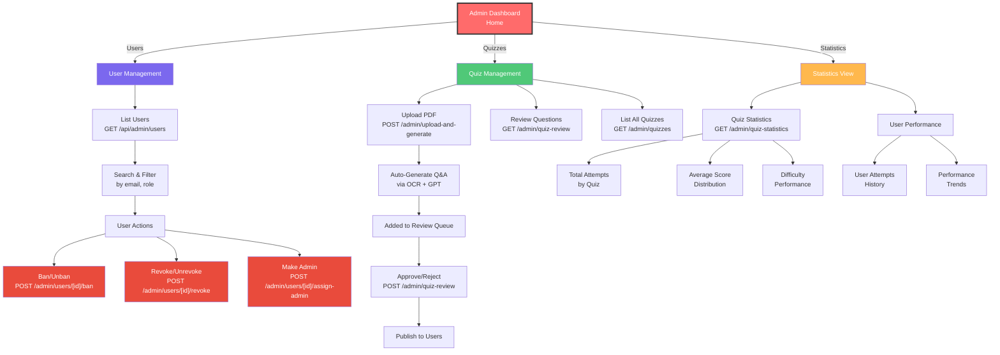

# NextQuizAI - Architecture & Sprint Diagrams

## 1. System Architecture Diagram



---

## 2. Database Entity Relationships

```mermaid
erDiagram
    USER ||--o{ ACCOUNT : has
    USER ||--o{ SESSION : has
    USER ||--o{ GAME : creates
    USER ||--o{ USERQUIZATTEMPT : attempts
    
    ACCOUNT }o--|| USER : belongs_to
    SESSION }o--|| USER : belongs_to
    
    EMAILVERIFICATIONTOKEN }o--|| USER : for
    
    GAME ||--|{ QUESTION : contains
    GAME }o--|| USER : belongs_to
    
    QUESTION }o--|| GAME : part_of
    
    ADMINQUIZ ||--|{ ADMINQUIZQUESTION : contains
    ADMINQUIZ }o--o{ USERQUIZATTEMPT : attempts
    
    ADMINQUIZQUESTION }o--|| ADMINQUIZ : part_of
    
    USERQUIZATTEMPT }o--|| USER : attempts_by
    USERQUIZATTEMPT }o--|| ADMINQUIZ : for
    
    TOPICCOUNT : tracks_popularity
    
    USER : id PK
    USER : email UK
    USER : banned
    USER : revoked
    USER : isAdmin
    USER : lastSeen
    
    GAME : id PK
    GAME : topic
    GAME : gameType
    GAME : timeStarted
    GAME : timeEnded
    
    QUESTION : id PK
    QUESTION : isCorrect
    QUESTION : percentageCorrect
    QUESTION : questionType
    
    ADMINQUIZ : id PK
    ADMINQUIZ : title
    ADMINQUIZ : status
    ADMINQUIZ : allowedAttempts
    
    USERQUIZATTEMPT : id PK
    USERQUIZATTEMPT : score
    USERQUIZATTEMPT : status
    USERQUIZATTEMPT : attemptNumber
```

---

## 3. API Routes Taxonomy

```mermaid
graph TD
    API["API Routes<br/>(33 Total)"]
    
    Auth["🔐 Authentication<br/>(4)"]
    Game["🎮 Game<br/>(3)"]
    Quiz["📋 Quiz<br/>(7)"]
    Question["❓ Questions<br/>(2)"]
    User["👤 User<br/>(2)"]
    Admin["🔑 Admin<br/>(17)"]
    Util["🔄 Utility<br/>(1)"]
    
    Auth1["POST /api/auth/register"]
    Auth2["POST /api/auth/verify-email"]
    Auth3["GET /api/auth/signin"]
    Auth4["POST /api/sign-out"]
    
    Game1["POST /api/game"]
    Game2["POST /api/checkAnswer"]
    Game3["POST /api/endGame"]
    
    Quiz1["POST /api/quiz/create"]
    Quiz2["POST /api/quiz/generate"]
    Quiz3["POST /api/quiz/[quizId]/start"]
    Quiz4["GET /api/quiz/[quizId]"]
    Quiz5["GET /api/published-quizzes"]
    Quiz6["GET /api/quiz/[quizId]/attempts"]
    Quiz7["POST /api/start-quiz"]
    
    Question1["POST /api/questions"]
    Question2["GET /api/questions"]
    
    User1["POST /api/user-quiz-stats"]
    User2["GET /api/user-quiz-stats"]
    
    AdminUser["User Mgmt<br/>(7)"]
    AdminQuiz["Quiz Mgmt<br/>(7)"]
    AdminStats["Statistics<br/>(3)"]
    
    AdminU1["GET /api/(admin)/users"]
    AdminU2["POST /api/(admin)/users/[id]/ban"]
    AdminU3["POST /api/(admin)/users/[id]/unban"]
    AdminU4["POST /api/(admin)/users/[id]/revoke"]
    AdminU5["POST /api/(admin)/users/[id]/unrevoke"]
    AdminU6["POST /api/(admin)/users/[id]/assign-admin"]
    AdminU7["GET /api/(admin)/users/[id]"]
    
    AdminQ1["POST /api/(admin)/upload-and-generate"]
    AdminQ2["GET /api/(admin)/quiz-review"]
    AdminQ3["POST /api/(admin)/quiz-review"]
    AdminQ4["GET /api/(admin)/quizzes"]
    AdminQ5["GET /api/(admin)/quizzes/[id]"]
    AdminQ6["POST /api/(admin)/quizzes/create"]
    AdminQ7["POST /api/(admin)/quizzes/upload"]
    
    AdminS1["GET /api/(admin)/quiz-statistics"]
    AdminS2["POST /api/(admin)/adjust-questions-difficulty"]
    AdminS3["POST /api/(admin)/setAdmin"]
    
    Util1["POST /api/auth/[...nextauth]"]
    
    API --> Auth
    API --> Game
    API --> Quiz
    API --> Question
    API --> User
    API --> Admin
    API --> Util
    
    Auth --> Auth1
    Auth --> Auth2
    Auth --> Auth3
    Auth --> Auth4
    
    Game --> Game1
    Game --> Game2
    Game --> Game3
    
    Quiz --> Quiz1
    Quiz --> Quiz2
    Quiz --> Quiz3
    Quiz --> Quiz4
    Quiz --> Quiz5
    Quiz --> Quiz6
    Quiz --> Quiz7
    
    Question --> Question1
    Question --> Question2
    
    User --> User1
    User --> User2
    
    Admin --> AdminUser
    Admin --> AdminQuiz
    Admin --> AdminStats
    
    AdminUser --> AdminU1
    AdminUser --> AdminU2
    AdminUser --> AdminU3
    AdminUser --> AdminU4
    AdminUser --> AdminU5
    AdminUser --> AdminU6
    AdminUser --> AdminU7
    
    AdminQuiz --> AdminQ1
    AdminQuiz --> AdminQ2
    AdminQuiz --> AdminQ3
    AdminQuiz --> AdminQ4
    AdminQuiz --> AdminQ5
    AdminQuiz --> AdminQ6
    AdminQuiz --> AdminQ7
    
    AdminStats --> AdminS1
    AdminStats --> AdminS2
    AdminStats --> AdminS3
    
    Util --> Util1
    
    style API fill:#FF6B6B,color:#fff,stroke:#333,stroke-width:3px
    style Auth fill:#4A90E2,color:#fff
    style Game fill:#7B68EE,color:#fff
    style Quiz fill:#50C878,color:#fff
    style Question fill:#FFB84D,color:#fff
    style User fill:#E94B3C,color:#fff
    style Admin fill:#9B59B6,color:#fff
    style Util fill:#95A5A6,color:#fff
    style AdminUser fill:#34495E,color:#fff
    style AdminQuiz fill:#34495E,color:#fff
    style AdminStats fill:#34495E,color:#fff
```



---

## 4. Sprint Implementation Timeline

```mermaid
gantt
    title NextQuizAI Implementation Across 5 Sprints
    dateFormat YYYY-MM-DD
    
    section Sprint 1
    Auth & Email Verification           :s1a, 2026-01-01, 30d
    Password & JWT Setup                :s1b, after s1a, 30d
    NextAuth Integration                :s1c, after s1b, 30d
    
    section Sprint 2
    Topic-Based Game Creation           :s2a, after s1c, 30d
    AI Question Generation              :s2b, after s2a, 30d
    Answer Grading (MCQ & Open-ended)   :s2c, after s2b, 30d
    
    section Sprint 3
    PDF Upload & Storage                :s3a, after s2c, 25d
    OCR 4-Layer Pipeline                :s3b, after s3a, 30d
    Question Generation from PDF        :s3c, after s3b, 25d
    
    section Sprint 4
    Quiz Review Interface               :s4a, after s3c, 20d
    Approval Workflow                   :s4b, after s4a, 20d
    Statistics Dashboard                :s4c, after s4b, 20d
    
    section Sprint 5
    User Quiz Attempts                  :s5a, after s4c, 25d
    Admin User Management               :s5b, after s5a, 25d
    Analytics & Recommendations         :s5c, after s5b, 25d
    
    section Testing
    Unit & Integration Tests            :test, after s1c, 150d
    Coverage: 92.44%                    :crit, s5c, 5d
```

---

## 5. Use Case Architecture



---

## 6. Data Flow: User Takes Quiz



---

## 7. OCR Pipeline Flow (Sprint 3)



---

## 8. Feature Completion Matrix



---

## 9. Technology Stack Diagram



---

## 10. Admin Dashboard Flow



---

**All diagrams represent the actual implementation across the 5 sprints.**
