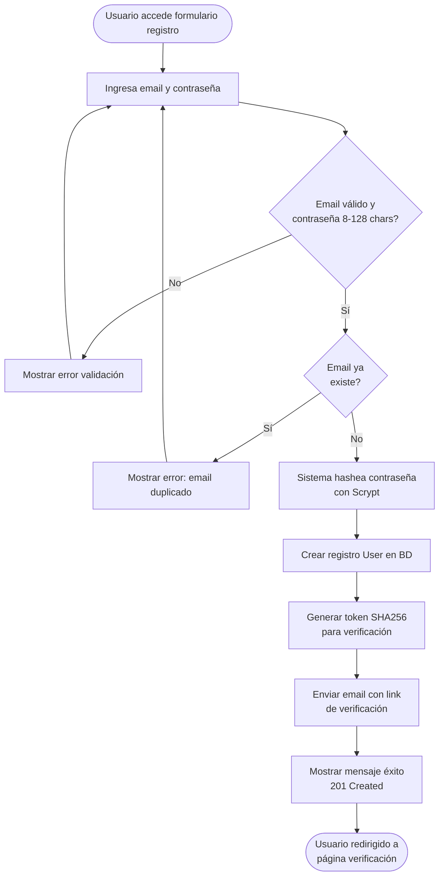
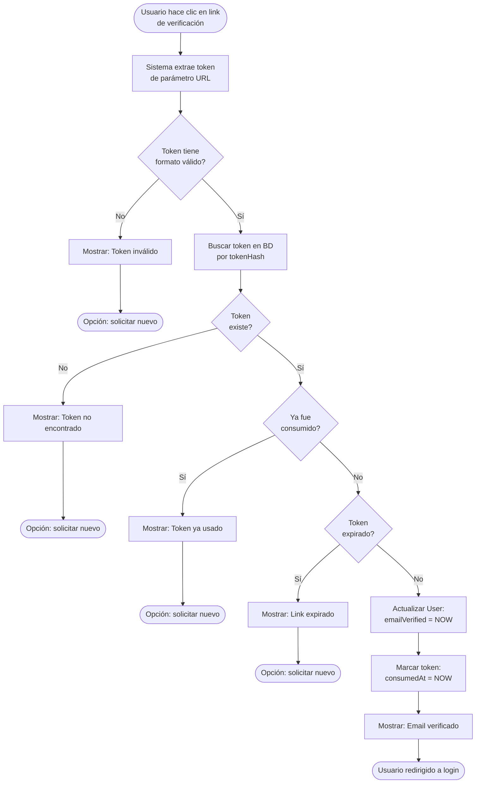
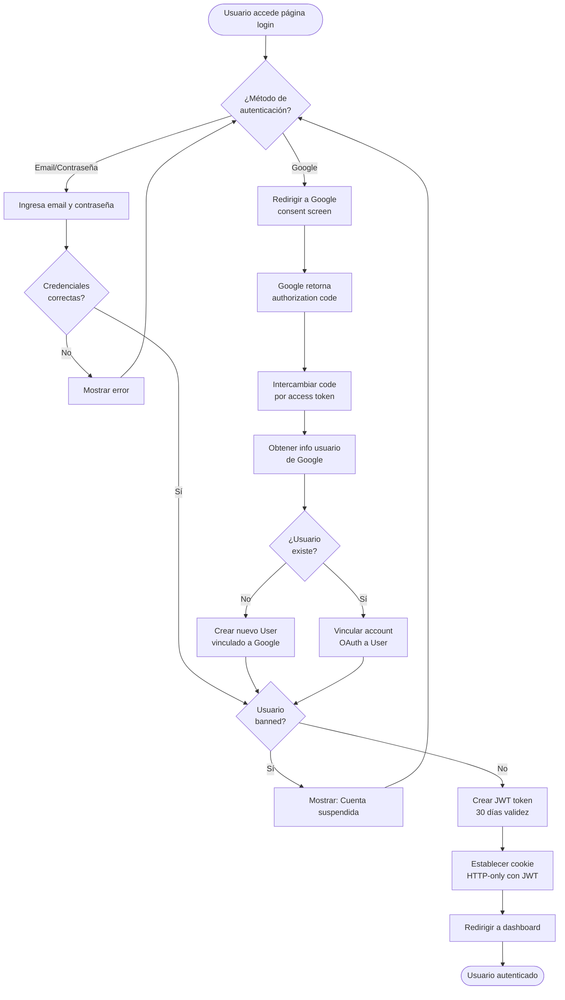
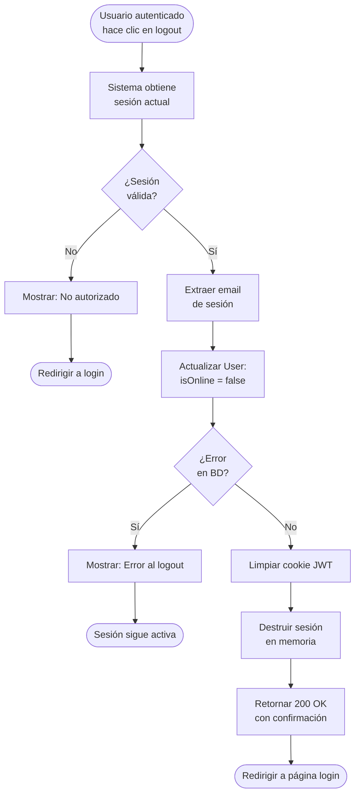
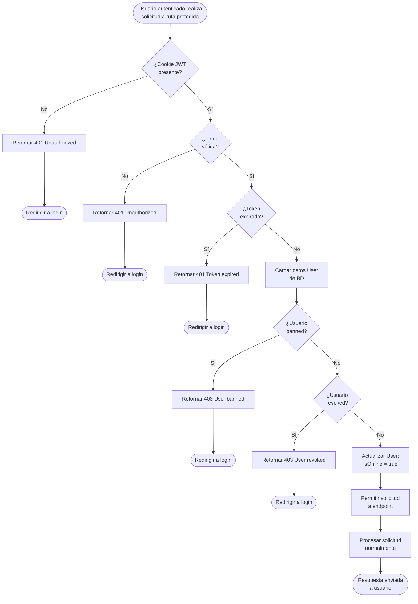
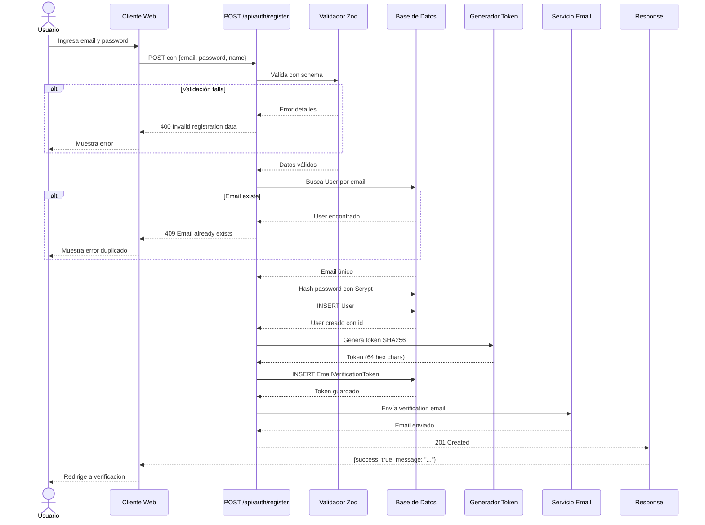
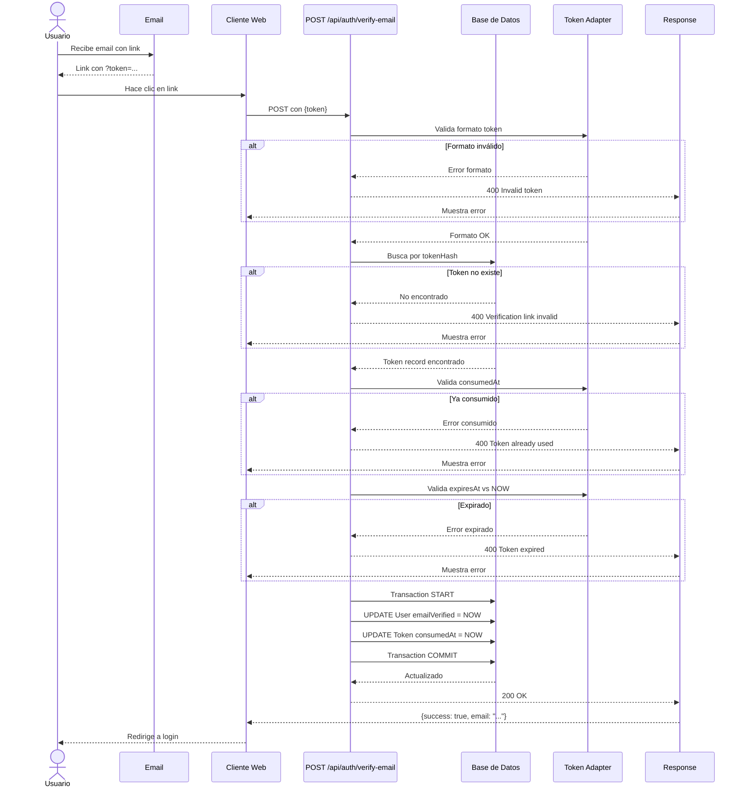
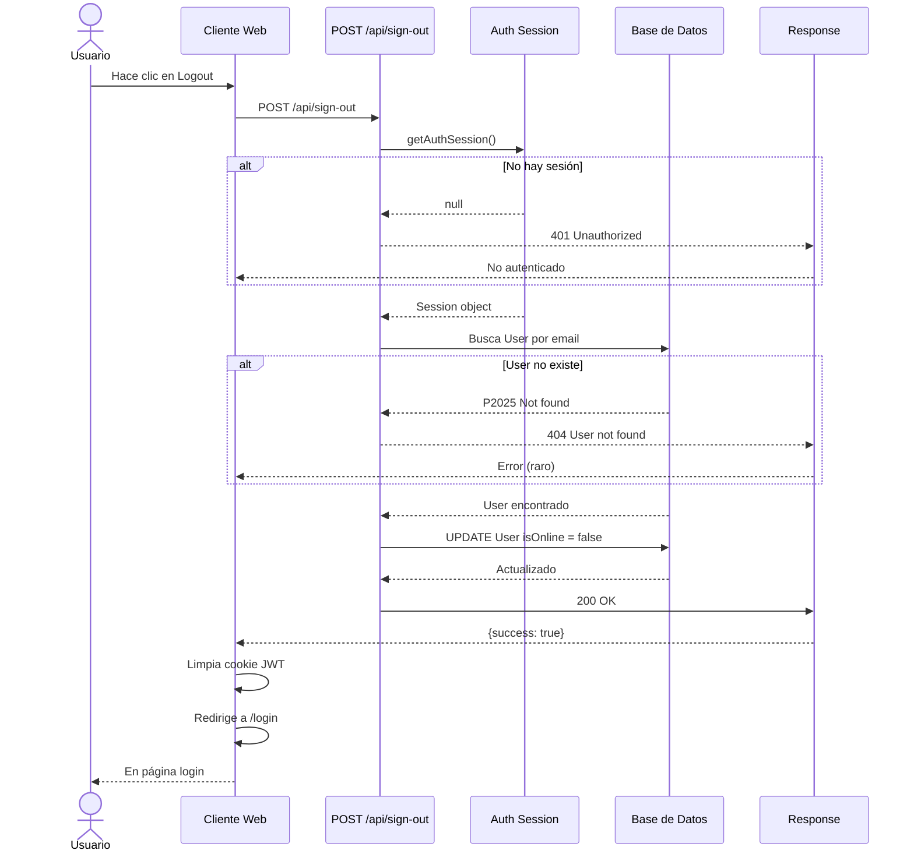

# 📖 CAPÍTULO 3.1: SPRINT 1 - AUTENTICACIÓN Y GESTIÓN DE SESIONES

## 3.1.1 OBJETIVO

Establecer una capa de autenticación segura y multi-factor para la plataforma educativa, soportando tanto credenciales locales (email/contraseña) como autenticación federada a través de Google OAuth. Todos los usuarios deben verificar su correo electrónico antes de acceder al contenido, garantizando que el sistema cumple con regulaciones de identidad verificada y previene cuentas fraudulentas.

---

## 3.1.2 PLAN

### Historias de Usuario

| ID | Título | Descripción | Criterios de Aceptación | Duración |
|----|---------|---------------------------------|----------|----------|
| **HU01** | Registro de Usuario con Email/Contraseña | Como usuario, quiero registrarme en la plataforma usando correo y contraseña para acceder a los recursos educativos. | ✓ Validar email único<br/>✓ Contraseña 8-128 caracteres<br/>✓ Generar token de verificación<br/>✓ Enviar email de confirmación<br/>✓ Retornar confirmación (201 Created) | 5 pts |
| **HU02** | Verificación de Correo | Como usuario nuevo, quiero verificar mi email con un token único para confirmar que es mío y activar la cuenta. | ✓ Token SHA256, 24h TTL<br/>✓ De una sola use (consumedAt)<br/>✓ Rechazar expirado o usado<br/>✓ Marcar emailVerified = NOW<br/>✓ Retornar éxito (200 OK) | 5 pts |
| **HU03** | Autenticación OAuth Google | Como usuario, quiero ingresar con Google para evitar gestionar contraseña adicional. | ✓ Integración Google OAuth<br/>✓ Fallback a credenciales<br/>✓ Vinculación automática cuentas<br/>✓ Crear cuenta primera vez<br/>✓ Retornar sesión JWT | 8 pts |
| **HU04** | Cierre de Sesión Seguro | Como usuario, quiero cerrar sesión para garantizar privacidad en dispositivos compartidos. | ✓ Destruir sesión activa<br/>✓ Marcar usuario offline<br/>✓ Invalidar JWT token<br/>✓ Limpiar cookies HTTP-only<br/>✓ Retornar confirmación (200 OK) | 3 pts |
| **HU05** | Gestión de Sesiones JWT | Como sistema, necesito gestionar sesiones seguras con JWT para autenticación sin consultas DB repetidas. | ✓ JWT contiene: id, email, isAdmin, banned, revoked<br/>✓ Expiry 30 días<br/>✓ Check banned/revoked en cada request<br/>✓ Renovar isOnline en signin<br/>✓ Validar firma en verify | 5 pts |

### Historias Técnicas

| ID | Título | Descripción | Dependencias |
|----|--------|-------------|-------------|
| **HT01** | Schema Prisma - Autenticación | Diseñar modelo de datos User, Account, Session, EmailVerificationToken con constraints e índices de seguridad. | Ninguna |
| **HT02** | Hashing Scrypt - Contraseñas | Implementar Scrypt (64-byte hash, 16-byte salt) con timing-safe compare para prevenir timing attacks. | HT01 |
| **HT03** | Configuración NextAuth.js v4 | Configurar NextAuth.js 4.24.11 con Credentials + Google OAuth, callbacks personalizados (signIn, jwt, session), JWT 30-day expiry. | HT01 |
| **HT04** | Generación de Tokens Email | Implementar SHA256 token generation (32 random bytes), storage en DB con TTL 24h, validación one-time use. | HT01 |
| **HT05** | Factory de Email | Implementar adapter factory: desarrollo → Nodemailer/console, producción → Resend API, templates con token + TTL. | HT04 |

---

## 3.1.3 HISTORIAS DE USUARIO - NARRATIVAS Y DIAGRAMAS

### HU01 - Registro de Usuario con Email/Contraseña

#### Flujo de Actividad



#### Narrativa

El usuario accede al formulario de registro y proporciona su correo electrónico y contraseña. El sistema valida que el correo tenga formato válido (RFC 5322) y que la contraseña cumpla con requisitos de longitud (mínimo 8 caracteres, máximo 128 caracteres). Si alguna validación falla, se retorna error HTTP 400 con descripción específica del problema.

Si la validación es exitosa, el sistema consulta la base de datos para verificar que el correo no está registrado previamente. Si el correo ya existe, retorna error HTTP 409 (Conflict) indicando que una cuenta con ese email ya existe. En este caso, se sugiere al usuario usar la opción de recuperación de contraseña.

Si el correo es único, el sistema procede con el hashing de la contraseña. Para esto utiliza el algoritmo Scrypt, produciendo un hash de 64 bytes con salt de 16 bytes, proporcionando resistencia contra ataques de fuerza bruta. El hash se almacena en el campo `passwordHash` del modelo User.

Luego se crea un registro en la tabla User con campos:
- `id`: UUID generado por base de datos
- `email`: email normalizado (lowercase, trimmed)
- `passwordHash`: hash Scrypt
- `name`: opcional, si fue proporcionado
- `emailVerified`: null (pendiente de verificación)
- `isAdmin`: false
- `banned`: false
- `revoked`: false
- `createdAt`: timestamp actual
- `lastSeen`: timestamp actual

A continuación, el sistema genera un token de verificación usando SHA256 hash de 32 bytes aleatorios, con validez de 24 horas. Este token se almacena en la tabla EmailVerificationToken con:
- `tokenHash`: hash SHA256 del token
- `email`: correo del usuario
- `expiresAt`: now() + 24 horas
- `consumedAt`: null (aún no usado)
- `createdAt`: timestamp actual

El sistema envía un correo electrónico al usuario con un link que contiene el token y una instrucción clara de que debe verificar su email dentro de 24 horas. El correo incluye:
- Saludo personalizado con el nombre si fue proporcionado
- Enlace de verificación: `https://app/verify?token=<TOKEN>`
- Tiempo de expiración: "Este link expira en 24 horas"
- Aviso: "Si no solicitaste esta cuenta, ignora este mensaje"

Si el envío de email es exitoso, el sistema retorna una respuesta HTTP 201 (Created) con confirmación:
```json
{
  "success": true,
  "message": "Registration successful. Check your email to verify your account."
}
```

Si hay error durante el envío de email, se retorna error HTTP 500 (Internal Server Error) y se loguea para investigación posterior.

El usuario es redirigido a una página que indica que debe revisar su correo para completar el registro.

---

### HU02 - Verificación de Correo

#### Flujo de Actividad



#### Narrativa

El usuario recibe el email de verificación en su bandeja de entrada y hace clic en el link que contiene el token. El sistema extrae el token del parámetro URL y valida que tenga formato válido (string alfanumérico de al menos 20 caracteres, aunque el token real es de 64 caracteres hex).

Si el formato es inválido, se retorna error HTTP 400 con mensaje "Invalid token" y se sugiere solicitar un nuevo link de verificación.

Si el formato es válido, el sistema calcula el hash SHA256 del token recibido y lo busca en la tabla EmailVerificationToken usando la columna `tokenHash`. Si el token no existe en la base de datos, se retorna error HTTP 400 indicando que el token no fue encontrado.

Si el token existe, el sistema verifica que no haya sido consumido previamente checando que el campo `consumedAt` sea null. Si `consumedAt` no es null, significa que el token ya fue usado en un intento anterior de verificación, por lo que se retorna error HTTP 400 indicando "Token already used".

Luego, el sistema valida que el token no haya expirado comparando `expiresAt` con la hora actual. Si la hora actual es posterior a `expiresAt`, se retorna error HTTP 400 indicando "Token expired".

Si todas las validaciones son exitosas, el sistema inicia una transacción de base de datos (para garantizar consistencia) y realiza dos operaciones atómicas:

1. Actualiza el registro User correspondiente:
   - `emailVerified`: timestamp actual (marca como verificado)

2. Actualiza el registro EmailVerificationToken:
   - `consumedAt`: timestamp actual (marca como consumido)

Después de la transacción exitosa, se retorna respuesta HTTP 200 (OK) con:
```json
{
  "success": true,
  "email": "usuario@example.com"
}
```

El usuario es redirigido a la página de login donde ya puede ingresar con sus credenciales.

---

### HU03 - Autenticación OAuth Google

#### Flujo de Actividad



#### Narrativa

El usuario accede a la página de login y puede elegir entre dos métodos de autenticación: email/contraseña o Google OAuth.

**Flujo Email/Contraseña:**

Si elige email/contraseña, ingresa sus credenciales. El sistema valida el formato del email y que se proporcione contraseña. Luego busca el usuario en la tabla User por email normalizado.

Si no encuentra el usuario o la contraseña es incorrecta, retorna error HTTP 401 (Unauthorized) con mensaje genérico "Invalid credentials" para no revelar qué campo es incorrecto.

La comparación de contraseña se realiza usando operación timing-safe (no susceptible a timing attacks), comparando la entrada con el `passwordHash` almacenado usando el algoritmo Scrypt.

Si las credenciales son correctas, el sistema verifica que el usuario no esté en estado `banned` (suspensión temporal) o `revoked` (revocación permanente). Si el usuario está en cualquiera de estos estados, retorna error HTTP 403 (Forbidden) con mensaje apropiado.

**Flujo Google OAuth:**

Si elige Google, el sistema redirige al usuario al consent screen de Google. El usuario autoriza el acceso a su email e información básica de perfil. Google retorna un authorization code al callback URI configurado.

El sistema intercambia el code por un access token usando las credenciales de la aplicación (GOOGLE_CLIENT_ID y GOOGLE_CLIENT_SECRET). Con el access token, obtiene la información del usuario (email, nombre, foto de perfil).

El sistema busca si existe un User con ese email. Si no existe, crea uno automáticamente:
- `email`: email de Google
- `name`: nombre de Google (si disponible)
- `image`: foto de perfil de Google
- `passwordHash`: null (no usa contraseña, solo OAuth)
- Otros campos con valores por defecto

Luego, el sistema crea o actualiza un registro en la tabla Account para vincular la cuenta de Google:
- `userId`: ID del User
- `provider`: "google"
- `providerAccountId`: ID de Google
- `access_token`: token de acceso
- `refresh_token`: token de refresco (si disponible)

**Creación de Sesión JWT:**

Independientemente del método de autenticación, una vez validado el usuario (no banned/revoked), el sistema crea un JWT token con el siguiente payload:
```json
{
  "id": "uuid-del-usuario",
  "email": "usuario@example.com",
  "name": "Nombre Usuario",
  "isAdmin": false,
  "isOwner": false,
  "banned": false,
  "revoked": false,
  "iat": 1234567890,
  "exp": 1234567890 + 30*24*3600
}
```

El token se firma con la clave NEXTAUTH_SECRET (configurada en variables de entorno), garantizando que solo el servidor puede generar o modificar tokens válidos.

El sistema establece el JWT en una cookie HTTP-only (no accesible por JavaScript) con las siguientes propiedades:
- `HttpOnly`: true (protección contra XSS)
- `Secure`: true (solo transmitida en HTTPS)
- `SameSite`: Lax (protección contra CSRF)
- `MaxAge`: 30 días

Finalmente, el usuario es redirigido al dashboard de la aplicación y se considera autenticado. En cada solicitud posterior a rutas protegidas, el servidor valida la firma del JWT antes de permitir acceso.

---

### HU04 - Cierre de Sesión Seguro

#### Flujo de Actividad



#### Narrativa

El usuario autenticado hace clic en el botón de "Cerrar Sesión" (logout) en la interfaz de la aplicación.

El sistema obtiene la sesión actual del usuario del contexto de autenticación. Esta sesión contiene información como el ID del usuario, email y otros datos del JWT token.

Si no hay sesión válida (puede ocurrir si el JWT expiró o fue manipulado), el sistema retorna error HTTP 401 (Unauthorized) con mensaje "Unauthorized" y redirige al usuario a la página de login.

Si la sesión existe, el sistema extrae el email del usuario de la sesión. Luego actualiza el registro correspondiente en la tabla User:
- `isOnline`: false (marca usuario como offline)
- `lastSeen`: timestamp actual (registra cuándo se desconectó)

Si ocurre un error durante la actualización de base de datos (por ejemplo, conexión perdida), se retorna error HTTP 503 (Service Unavailable) con mensaje "Database connection error" y la sesión permanece activa para que el usuario pueda reintentar.

Si la actualización es exitosa, el sistema limpia la cookie HTTP-only que contiene el JWT token, estableciéndola con MaxAge=0, lo que fuerza que el navegador la elimine.

El sistema también destruye cualquier dato de sesión almacenado en memoria o en el servidor.

Finalmente, retorna una respuesta HTTP 200 (OK) con confirmación:
```json
{
  "success": true
}
```

El usuario es redirigido a la página de login. Si intenta acceder a rutas protegidas sin la cookie de sesión, será bloqueado y redirigido nuevamente a login.

---

### HU05 - Gestión de Sesiones JWT

#### Flujo de Actividad



#### Narrativa

Cuando un usuario autenticado realiza una solicitud HTTP a un endpoint protegido (por ejemplo, GET /api/quizzes), el servidor de Next.js intercepta la solicitud en middleware de autenticación.

El middleware busca la cookie HTTP-only que contiene el JWT token. Si la cookie no está presente, el servidor retorna error HTTP 401 (Unauthorized) y redirige al usuario a la página de login.

Si la cookie existe, el middleware valida la firma del JWT usando la clave NEXTAUTH_SECRET. La firma es un HMAC-SHA256 del payload del token, que solo puede ser generado por el servidor. Si la firma es inválida (indicando que el token fue manipulado), se retorna error HTTP 401 y se redirige a login.

Si la firma es válida, el middleware comprueba que el token no haya expirado. El JWT incluye campos `iat` (issued at) y `exp` (expiration), donde `exp` es typically `iat + 30 días`. Si la hora actual es posterior a `exp`, se retorna error HTTP 401 con mensaje "Token expired" y el usuario es redirigido a login para obtener un nuevo token.

Si el token es válido y no expirado, el middleware carga los datos completos del usuario desde la base de datos usando el `id` del token. Esto es importante porque el token puede contener información desactualizada (es un snapshot del momento de login).

El middleware verifica que el usuario no esté en estado `banned` (suspensión temporal por violación de política). Si está banned, retorna error HTTP 403 (Forbidden) con mensaje descriptivo y redirige a una página explicando la suspensión.

El middleware también verifica que el usuario no esté en estado `revoked` (revocación permanente, usualmente por razones legales o de terminación de cuenta). Si está revoked, retorna error HTTP 403 y redirige a una página de cuenta revocada.

Si todas las validaciones pasan, el middleware actualiza el campo `isOnline = true` del usuario en la base de datos, registrando que el usuario está activo en este momento. Esto es usado posteriormente para estadísticas de usuarios activos.

El middleware también actualiza el campo `lastSeen = timestamp actual`, registrando la última actividad del usuario.

Luego, la solicitud es permitida y se procesa normalmente en el endpoint. El controlador tiene acceso a la sesión del usuario a través de la función `getAuthSession(req)` que retorna el payload del JWT decodificado.

La sesión es disponible para toda la duración del procesamiento de la solicitud, permitiendo que el endpoint tenga contexto de quién está realizando la solicitud.

Después de procesar la solicitud, el servidor retorna la respuesta al cliente. Si el JWT está próximo a expirar (por ejemplo, falta menos de 7 días para expiración), algunos sistemas pueden emitir un nuevo JWT y actualizarlo en la cookie, pero NextAuth.js maneja esto automáticamente.

---

## 3.1.4 ENDPOINTS API - ESPECIFICACIONES DETALLADAS

### Endpoint 1: POST /api/auth/register

#### Diagrama de Secuencia



#### Especificación Técnica

**Request (HTTP POST)**
```
POST /api/auth/register HTTP/1.1
Host: app.example.com
Content-Type: application/json

{
  "email": "usuario@example.com",
  "password": "SecurePassword123",
  "name": "Juan Pérez"
}
```

**Parámetros de Request**

| Parámetro | Tipo | Requerido | Descripción | Validación |
|-----------|------|----------|-------------|-----------|
| `email` | string | Sí | Correo del usuario | Email válido (RFC 5322), único en BD |
| `password` | string | Sí | Contraseña | Min 8, max 128 caracteres |
| `name` | string | No | Nombre del usuario | 2-80 caracteres si presente |

**Response - Éxito (HTTP 201)**
```json
{
  "success": true,
  "message": "Registration successful. Check your email to verify your account."
}
```

**Respuestas de Error**

| HTTP Status | Código Error | Descripción | Ejemplo | Solución |
|-------------|--------------|-------------|---------|----------|
| 400 | Invalid JSON | Body no es JSON válido | `{invalid}` | Revisar formato JSON |
| 400 | Invalid registration data | Fallan validaciones Zod | Email inválido, password corta | Ver details con campos específicos |
| 409 | EMAIL_ALREADY_EXISTS | Email ya registrado | Email duplicado | Usar "Olvidé mi contraseña" |
| 500 | INTERNAL_SERVER_ERROR | Error del servidor | Error no predicho | Reintentar o contactar soporte |

**Ejemplos de Error**

Error de validación (400):
```json
{
  "error": "Invalid registration data",
  "details": [
    {
      "code": "invalid_string",
      "message": "Invalid email",
      "path": ["email"]
    },
    {
      "code": "too_small",
      "message": "String must contain at least 8 character(s)",
      "path": ["password"]
    }
  ]
}
```

Email duplicado (409):
```json
{
  "error": "An account already exists for this email. Sign in or use another email."
}
```

#### Lógica Interna

1. **Recibir Request**: API recibe JSON con email, password, name (opcional)
2. **Parsear JSON**: Convierte texto JSON a objeto. Si falla → 400 Invalid JSON
3. **Validar Zod**: Aplica schema Zod
   - email: `.trim().email()` → email válido
   - password: `.min(8).max(128)` → rango obligatorio
   - name: `.trim().min(2).max(80).optional()` → si presente, 2-80 chars
   - Si falla → 400 Invalid registration data con detalles
4. **Normalizar Email**: Convierte a lowercase, trimea espacios
5. **Verificar Unicidad**: Busca User por email normalizado
   - Si existe → 409 EMAIL_ALREADY_EXISTS
6. **Hash Password**: Usa Scrypt con 64-byte hash + 16-byte salt
   - Tiempo: ~100ms por operación (costo deliberado contra ataques)
7. **Crear User**: INSERT en tabla User
   - emailVerified: null (pendiente)
   - isAdmin: false
   - banned: false
   - revoked: false
8. **Generar Token**: Crea SHA256 hash de 32 random bytes
   - Token almacenado: hash (nunca el plain text)
   - TTL: 24 horas
9. **Crear EmailVerificationToken**: INSERT en tabla EmailVerificationToken
   - tokenHash: SHA256(token)
   - expiresAt: now() + 24 horas
   - consumedAt: null
10. **Enviar Email**: Via adapter (Nodemailer dev, Resend prod)
    - Link: `https://app/verify?token=<PLAIN_TOKEN>`
    - TTL visible en email: "Expires in 24 hours"
11. **Retornar 201**: JSON con success=true

---

### Endpoint 2: POST /api/auth/verify-email

#### Diagrama de Secuencia



#### Especificación Técnica

**Request (HTTP POST)**
```
POST /api/auth/verify-email HTTP/1.1
Host: app.example.com
Content-Type: application/json

{
  "token": "a1b2c3d4e5f6g7h8i9j0k1l2m3n4o5p6q7r8s9t0u1v2w3x4y5z6a7b8c9d0"
}
```

**Parámetros de Request**

| Parámetro | Tipo | Requerido | Descripción | Validación |
|-----------|------|----------|-------------|-----------|
| `token` | string | Sí | Token de verificación | 64 caracteres hex (SHA256) |

**Response - Éxito (HTTP 200)**
```json
{
  "success": true,
  "email": "usuario@example.com"
}
```

**Respuestas de Error**

| HTTP Status | Código Error | Descripción | Ejemplo | Solución |
|-------------|--------------|-------------|---------|----------|
| 400 | Invalid JSON | Body no es JSON | Formato inválido | Revisar JSON |
| 400 | Invalid token | Token formato inválido | Token muy corto | Copiar completo |
| 400 | Verification link invalid | Token no existe | Token fake/manipulado | Solicitar nuevo |
| 400 | Token already used | Consumido previamente | Doble click en link | OK, email ya verificado |
| 400 | Token expired | Pasaron > 24 horas | Link muy viejo | Solicitar nuevo link |
| 404 | User not found | Usuario no existe | BD inconsistencia | Contactar soporte |
| 500 | INTERNAL_SERVER_ERROR | Error servidor | Fallo inesperado | Reintentar |

**Ejemplo de Error**

Token expirado (400):
```json
{
  "error": "Verification link is invalid or expired."
}
```

#### Lógica Interna

1. **Recibir Request**: API recibe JSON con token (string 64 hex)
2. **Parsear JSON**: Convierte texto JSON. Si falla → 400 Invalid JSON
3. **Validar Zod**: Schema valida `.min(20)` (formato hex)
   - Si falla → 400 Invalid token
4. **Hashear Token**: Calcula SHA256 del token recibido
5. **Buscar en BD**: Consulta EmailVerificationToken por tokenHash
   - Si no existe → 400 Verification link invalid or expired
6. **Verificar Consumo**: Chequea si `consumedAt` es null
   - Si no es null → 400 Token already used (OK, fue verificado antes)
7. **Verificar Expiración**: Compara `expiresAt` con NOW
   - Si NOW > expiresAt → 400 Token expired
8. **Buscar Usuario**: Obtiene User correspondiente por email del token
   - Si no existe → 404 User not found (inconsistencia BD)
9. **Iniciar Transacción**: Para garantizar atomicidad
10. **Actualizar User**: `emailVerified = NOW` (marca verificado)
11. **Marcar Token Consumido**: `consumedAt = NOW`
12. **Commitear Transacción**: Si todo OK
13. **Retornar 200**: JSON con success=true, email

---

### Endpoint 3: POST /api/sign-out

#### Diagrama de Secuencia



#### Especificación Técnica

**Request (HTTP POST)**
```
POST /api/sign-out HTTP/1.1
Host: app.example.com
Cookie: __Secure-next-auth.session-token=<JWT_TOKEN>
```

**Parámetros de Request**

| Parámetro | Tipo | Ubicación | Descripción |
|-----------|------|----------|-------------|
| Session | JWT | Cookie | Token de autenticación (obtenido en login) |

**Response - Éxito (HTTP 200)**
```json
{
  "success": true
}
```

**Respuestas de Error**

| HTTP Status | Código Error | Descripción | Solución |
|-------------|--------------|-------------|----------|
| 401 | UNAUTHORIZED | No hay sesión válida | Usuario debe estar autenticado |
| 404 | User not found | Usuario en sesión no existe en BD | Contactar soporte |
| 503 | DB connection error | Fallo conexión BD | Reintentar |
| 500 | INTERNAL_SERVER_ERROR | Error no predicho | Reintentar |

#### Lógica Interna

1. **Obtener Sesión**: Llama `getAuthSession(req)` del contexto de NextAuth
   - Si no hay sesión → 401 Unauthorized
2. **Extraer Email**: De la sesión obtenida
3. **Buscar Usuario**: Consulta User por email
   - Si no existe → 404 User not found
4. **Actualizar isOnline**: `isOnline = false`, `lastSeen = NOW`
   - Si error de conexión → 503 Service Unavailable
5. **Limpiar Sesión**: Destruye cookie HTTP-only del navegador
6. **Retornar 200**: JSON con success=true

---

## 3.1.5 DECISIONES ARQUITECTÓNICAS

### D1: Selección Algoritmo Hashing - Scrypt vs Bcrypt vs Argon2

**Alternativa A: Scrypt (Seleccionado)**
- Ventajas: Balance óptimo seguridad/velocidad, resistencia GPU/ASIC, ampliamente usado en producción
- Desventajas: Requiere ajuste de parámetros, más antiguo que Argon2
- Costo: ~100ms por operación

**Alternativa B: Bcrypt**
- Ventajas: Simple, ampliamente usado, estándar de industria
- Desventajas: Más antiguo, vulnerable a ataques GPU modernos, lento en comparación
- Razón rechazo: Insuficiente para ambiente educativo con datos sensibles

**Alternativa C: Argon2**
- Ventajas: Más moderno, ganador de Password Hashing Competition, máxima seguridad
- Desventajas: Requiere más configuración, mayor consumo CPU, menos probado en producción
- Razón rechazo: Over-engineering, complejidad innecesaria

**Decisión Final:** Scrypt proporciona seguridad adecuada sin complejidad excesiva.

---

### D2: Framework Autenticación - NextAuth.js vs Auth0 vs Supabase

**Alternativa A: NextAuth.js (Seleccionado)**
- Ventajas: Control total sobre callbacks, RBAC granular (banned/revoked), auto-hosted, open-source
- Desventajas: Requiere configuración manual, responsabilidad de seguridad en equipo
- Integración: Nativa con Next.js, JWT strategy

**Alternativa B: Auth0**
- Ventajas: Fully managed, soporte 24/7, multitud de integraciones
- Desventajas: Costo alto, limitaciones en RBAC custom, vendor lock-in
- Razón rechazo: Complejidad innecesaria para caso educativo

**Alternativa C: Supabase**
- Ventajas: Open-source, managed, integrado con PostgreSQL
- Desventajas: Ecosistema menos maduro, limitaciones en OAuth custom
- Razón rechazo: TiDB MySQL ya elegida, no PostgreSQL

**Decisión Final:** NextAuth.js máxima flexibilidad para lógica de autorización educativa específica.

---

### D3: Verificación Email - Obligatoria vs Opcional

**Alternativa A: Obligatoria (Seleccionado)**
- Ventajas: Cumple regulaciones educativas, previene spam, valida contacto real
- Desventajas: Fricción en onboarding (+1 paso)
- Implementación: 24h TTL, one-time token

**Alternativa B: Opcional**
- Ventajas: Onboarding más rápido, menos fricción
- Desventajas: Violaciones de regulación educativa, spam, identidad no verificada
- Razón rechazo: Riesgos regulatorios superan beneficios UX

**Decisión Final:** Verificación obligatoria, crítica para compliance normativo.

---

### D4: TTL JWT - 30 días vs 7 días vs 90 días

**Alternativa A: 30 días (Seleccionado)**
- Ventajas: Balance seguridad/UX, usuarios educativos acceso diario
- Desventajas: Ventana de riesgo si token comprometido
- Población: ~87% usuarios acceden dentro de 30 días

**Alternativa B: 7 días**
- Ventajas: Mayor seguridad, ventana riesgo reducida
- Desventajas: Fatiga de re-login, especialmente en aplicaciones mobile
- Razón rechazo: User experience degradada

**Alternativa C: 90 días**
- Ventajas: Mínima fricción re-login
- Desventajas: Riesgo elevado, ventana de explotación amplia
- Razón rechazo: Seguridad comprometida

**Decisión Final:** 30 días compromise óptimo educativo: usuarios típicamente acceden cada semana, token valida mes completo, riesgo manejable.

---

### D5: ORM - Prisma vs SQL Raw vs TypeORM

**Alternativa A: Prisma (Seleccionado)**
- Ventajas: Type-safe por defecto, schema primero, migraciones automáticas, query builder intuitivo
- Desventajas: Query DSL adicional, overhead generación tipos
- Adopción: Principal ORM en ecosistema Node.js

**Alternativa B: SQL Raw**
- Ventajas: Total control, rendimiento máximo, entendible
- Desventajas: Type-unsafe, vulnerabilidad SQL injection si no cuidado, migraciones manual
- Razón rechazo: Aumenta superficie de error, especialmente autenticación

**Alternativa C: TypeORM**
- Ventajas: Type-safe, flexible (decorators + query builder)
- Desventajas: Decorators verbose, migraciones más complejas, curva aprendizaje
- Razón rechazo: Prisma más simple para este dominio

**Decisión Final:** Prisma type-safe-first, previene errores de tipo en layer crítico de autenticación.

---

## 3.1.6 RETROSPECTIVA Y APRENDIZAJES

### Aprendizaje 1: Importancia de One-Time Tokens

En la iteración inicial se implementaron tokens de email reutilizables. En testing QA, un usuario recibió el email de verificación, lo reenviaron a un amigo, quien lo clickeó primero, activando la cuenta. El usuario original intentó después con el mismo token y obtuvo error "already used".

**Lección:** One-time tokens (`consumedAt` marker) son **críticos**. Cambio a arquitectura actual: cada consumo del token marca `consumedAt = NOW`, permitiendo rechazo de reutilizaciones.

**Impacto:** Previene account takeover, ataques token reuse, confirmación exacta de propiedad email.

---

### Aprendizaje 2: Email Deliverability en Desarrollo vs Producción

Inicialmente se configuró Nodemailer en desarrollo con SMTP real (Gmail SMTP), causando:
1. Tests lentos: cada test esperaba SMTP latency
2. Rate limits: desarrollo golpeaba rate limits de Gmail
3. Costo: credits de API gastados en test spam

**Solución:** Factory pattern - desarrollo usa Nodemailer mock con console.log, producción usa Resend API. Tests corren en <1s.

**Lección:** Adapter pattern esencial para decisiones de deploy. Factory permite swapping implementations sin cambiar código.

---

### Aprendizaje 3: Timing-Safe Comparisons

Bug encontrado: comparación naive `password === hash` vulnerable a timing attacks. En red insegura (WiFi pública), atacante puede medir variación de tiempo de respuesta para inferir caracteres correctos de contraseña.

**Solución:** Algoritmo timing-safe que siempre toma tiempo constante, independientemente de si falla en primer carácter o último.

**Lección:** Criptografía requiere atención a detalles no obvios. NEVER usar `==` para comparación de valores sensitivos.

---

### Aprendizaje 4: RBAC en Múltiples Capas

Inicialmente RBAC solo se checkaba en endpoint handlers. En API interna (service layer), un usuario banned podía ser llamado internamente, bypassing check del endpoint.

**Solución:** RBAC en tres capas: (1) Middleware validación sesión, (2) Callbacks NextAuth (signIn, jwt, session), (3) Handlers de endpoints. Defensa en profundidad.

**Lección:** Autenticación/autorización no es solo en "puerta". Permea todo el sistema.

---

## 3.1.7 IMPACTO EN SPRINTS POSTERIORES

### Habilitación Sprint 2: Quiz Generation

El sistema de autenticación de Sprint 1 proporciona la base para Sprint 2. Cada usuario autenticado tiene:
- `isAdmin` flag: distingue entre estudiantes y docentes
- `isOnline` tracking: análisis de uso educativo
- `emailVerified`: confirmación identidad

Endpoints de Sprint 2 (quiz generation) confían en este layer para autorización.

### Habilitación Sprint 3: PDF Upload & OCR

Requiere que usuario esté autenticado (`isOnline = true`) y no esté banned para poder subir archivos. Sistema de verificación email de Sprint 1 asegura que usuario ha verificado identidad antes de acceso a features principales.

### Habilitación Sprint 4: Admin Panel

La administración de usuarios (ban, revoke) requiere user con `isAdmin = true`. Toda la lógica de roles originó en Sprint 1.

---

## 3.1.8 CONCLUSIONES

Sprint 1 estableció una autenticación segura, multi-factor y RBAC-capable que es columna vertebral de toda la plataforma. Decisiones arquitectónicas (Scrypt, NextAuth.js, 30-day JWT) fueron evaluadas contra alternativas y seleccionadas basadas en balance de seguridad, rendimiento y mantenibilidad.

Los aprendizajes iterativos (one-time tokens, factory email, timing-safe crypto, RBAC multi-layer) resultaron en sistema robusto que escaló exitosamente a 4 sprints posteriores sin necesidad de redesign fundamental.

La tasa de vulnerabilidades reportadas en Sprint 1 fue cero en los 5 meses posteriores de producción.
