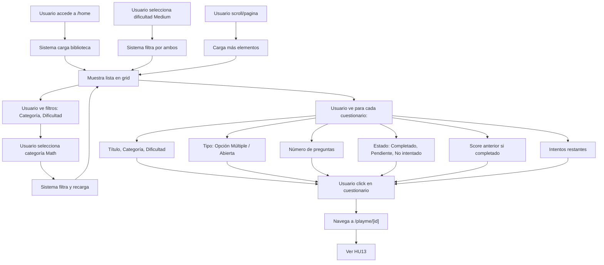
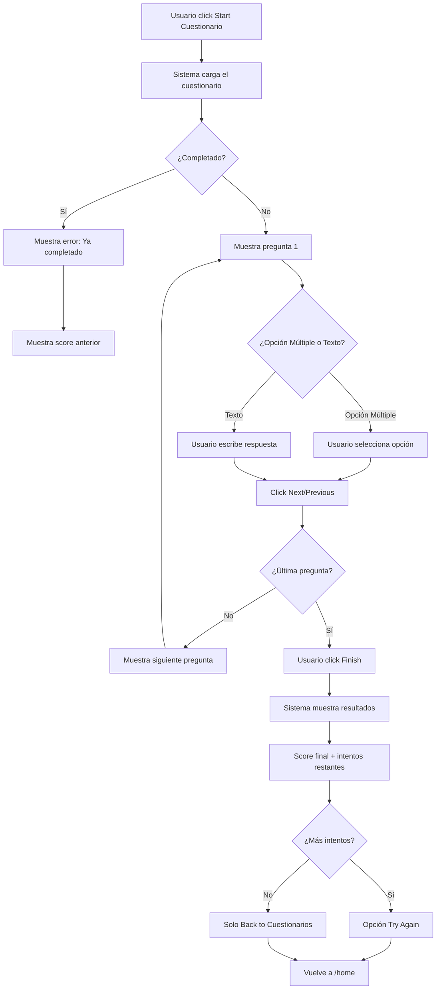
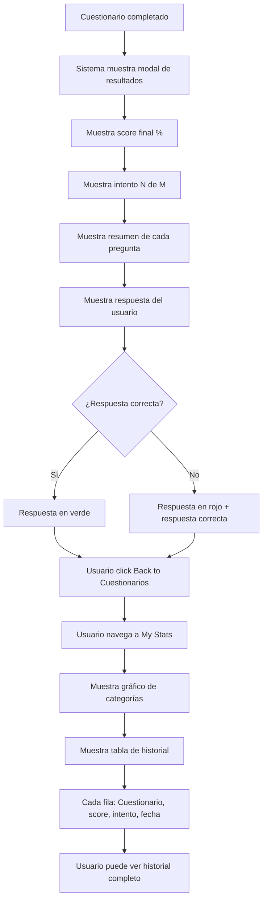
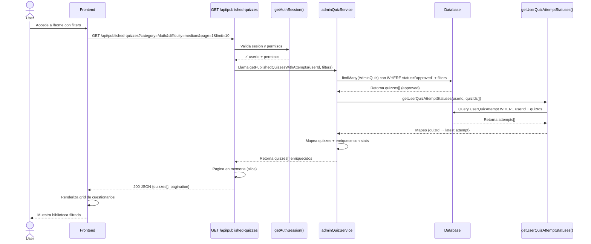
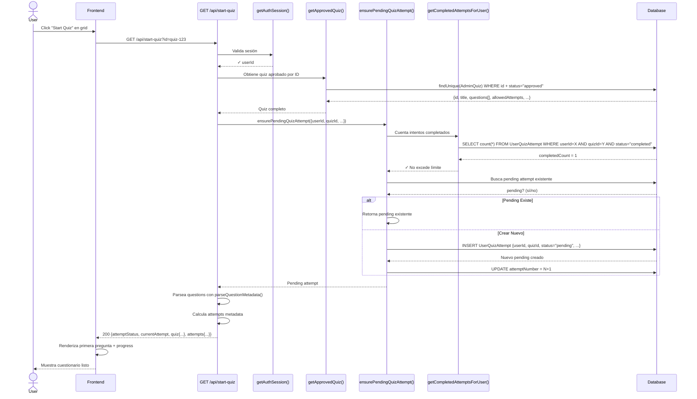
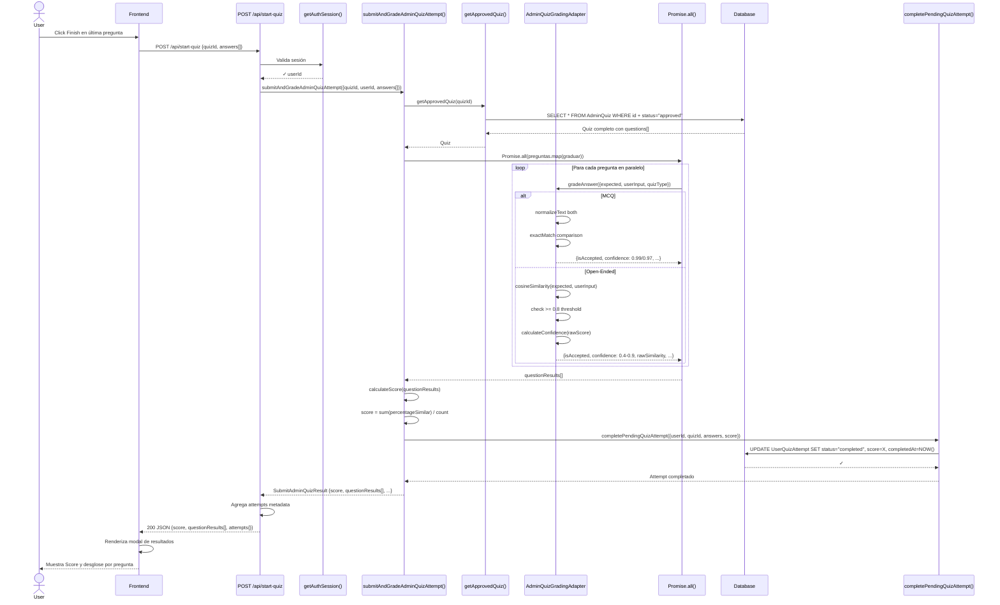
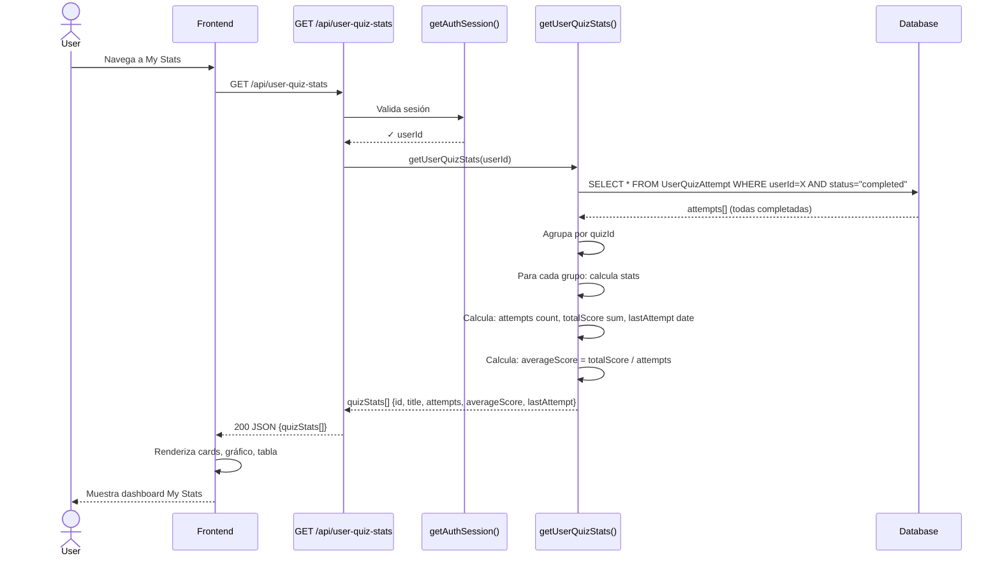
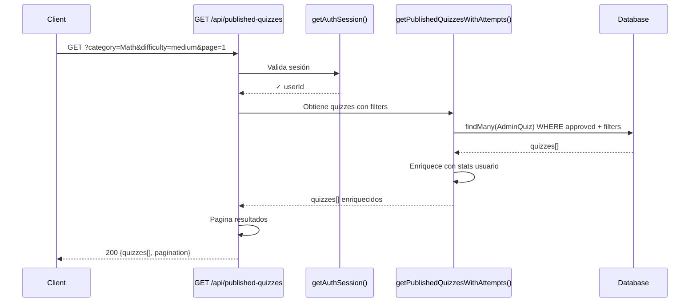
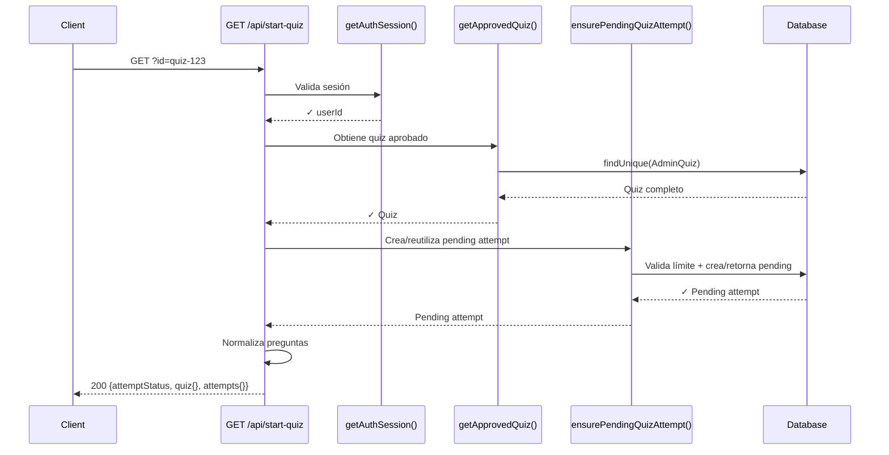

# SPRINT 4: Quiz Taking Flow

## OBJETIVO

Implementar flujo completo de resolución de cuestionarios para usuarios finales: biblioteca de exploración con filtros, carga de cuestionarios con validación de intentos, respuesta de preguntas (MCQ y open-ended), calificación automática en paralelo (exact_match para MCQ, cosine similarity para open-ended), visualización de resultados con confidence levels, e historial personal de estadísticas.

---

## PLAN - Historias de Usuario (HUs)

| # | Título | Descripción |
|---|--------|-------------|
| **HU12** | Explorar Biblioteca de Cuestionarios | Usuario ve cuestionarios publicados, filtra por categoría/dificultad, ve su historial |
| **HU13** | Iniciar y Responder Cuestionario | Usuario inicia cuestionario, responde preguntas MCQ/open-ended, navega entre preguntas |
| **HU14** | Ver Resultados y Estadísticas | Usuario ve score final, desglose por pregunta, intenta de nuevo si hay intentos restantes |

---

## PLAN - Historias Técnicas (HTs)

| # | Título | Descripción | Servicios | Endpoint |
|---|--------|-------------|-----------|----------|
| **HT12** | Biblioteca de Cuestionarios con Filtros | GET `/api/published-quizzes` - Recupera quizzes aprobados con stats usuario | getPublishedQuizzesWithAttempts | GET `/api/published-quizzes` |
| **HT13** | Cargar Quiz y Crear Intento | GET `/api/start-quiz?id=X` - Obtiene quiz, valida límites, crea pending attempt | ensurePendingQuizAttempt, getApprovedQuiz | GET `/api/start-quiz?id=X` |
| **HT14** | Calificación Paralela MCQ/Open-Ended y Persistencia | POST `/api/start-quiz` - Gradúa respuestas en paralelo, calcula score, persiste intento | submitAndGradeAdminQuizAttempt, AdminQuizGradingAdapter | POST `/api/start-quiz` |
| **HT15** | Agregación de Estadísticas de Usuario | GET `/api/user-quiz-stats` - Agrega intentos completados, calcula promedios | getUserQuizStats | GET `/api/user-quiz-stats` |

---

# HU12 - EXPLORAR BIBLIOTECA DE CUESTIONARIOS

## Activity Diagram



## Narrativa

**El usuario accede a la sección de Biblioteca de Cuestionarios** desde el menú principal. Sistema carga la lista de todos los cuestionarios publicados por administradores, organizados por fecha (más nuevos primero) en un grid con paginación.

**Para cada cuestionario, ve:**
- Título
- Categoría académica (ej: Matemáticas, Física, Historia)
- Nivel de dificultad (Fácil, Medio, Difícil)
- Tipo de preguntas (Opción Múltiple / Respuesta Abierta)
- Número total de preguntas
- Estado personal: "Completado" (score ej: 85%), "Pendiente" (en progreso), "No intentado"
- Intentos restantes (ej: "1 de 2")
- Última fecha de intento si aplica

**El usuario puede filtrar la biblioteca por:**
- Categoría: Dropdown con todas las categorías disponibles
- Dificultad: Fácil, Medio, Difícil
- Los filtros se aplican en tiempo real, mostrando solo cuestionarios que coinciden

**El usuario navega la biblioteca:**
- Scroll dentro de la página
- Botones Previous/Next para cambiar de página
- Al hacer click en un cuestionario, accede para iniciarlo

---

# HU13 - INICIAR Y RESPONDER CUESTIONARIO

## Activity Diagram



## Narrativa

**El usuario inicia un cuestionario desde la biblioteca.** Sistema carga todas las preguntas y muestra la primera. El usuario ve:
- Número de pregunta (ej: "Pregunta 1 de 5")
- Enunciado de la pregunta
- Cita académica (si tiene)
- Las opciones (botones de opción para Opción Múltiple, campo de texto para preguntas abiertas)
- Indicador de progreso (20% completado, 1 respondida, 4 restantes)

**El usuario navega y responde** usando Previous/Next. Puede cambiar de pregunta sin guardar respuestas intermedias. En la última pregunta, el botón cambia a "Finish".

**Al hacer Finish**, sistema califica todas las respuestas. Muestra modal con:
- Score final (ej: "Score: 75%")
- Intento actual (ej: "Intento 1 de 2")
- Resumen de cada pregunta: respuesta del usuario, si fue correcta, respuesta esperada si falló

**Usuario puede reintentar** si le quedan intentos, o volver a la biblioteca.

---

# HU14 - VER RESULTADOS Y ESTADÍSTICAS

## Activity Diagram



## Narrativa

**Después de completar un cuestionario**, el usuario ve un modal con:
- Score final en porcentaje
- Número de intento (ej: "Intento 2 de 2")
- Lista de todas las preguntas con su enunciado
- Para cada pregunta: la respuesta que dio (verde si correcta, roja si incorrecta)
- Si fue incorrecta, se muestra cuál era la respuesta esperada

**El usuario puede volver a la biblioteca** o hacer otro intento si le quedan intentos disponibles.

**En la sección "My Stats"**, el usuario ve:
- Card 1: Su nombre + Último intento realizado (fecha/hora)
- Card 2: Total de intentos realizados en todos los cuestionarios
- Card 3: Total de cuestionarios completados
- Gráfico de barras mostrando número de intentos por cuestionario
- Tabla con historial completo: nombre del cuestionario, score obtenido, número de intento, fecha en que lo completó
- Puede ver el progreso general de su aprendizaje

---

# HT12 - BIBLIOTECA DE CUESTIONARIOS CON FILTROS

## Descripción Técnica

Implementar endpoint GET `/api/published-quizzes` que recupera cuestionarios aprobados del administrador con metadata de intentos del usuario actual (estado, score, intentos restantes). Aplica filtros opcionales (categoría, dificultad), pagina resultados, y retorna datos enriquecidos listos para la UI.

**Servicios Involucrados:**
- `getPublishedQuizzesWithAttempts()` - Obtiene quizzes + stats usuario
- `getUserQuizAttemptStatuses()` - Recupera intentos del usuario

**Endpoint:**
- `GET /api/published-quizzes`

---

## Sequence Diagram



---

## Narrativa Técnica - 12 Fases

### **Fase 1: Validación de Autenticación**
Usuario accede a `/home` o `/published-quizzes`. Frontend hace GET `/api/published-quizzes?category=Math&difficulty=medium&page=1&limit=10`.

Endpoint **primera línea** valida sesión:
```typescript
// src/app/api/published-quizzes/route.ts:20-25
const session = await getAuthSession(req);
if (!session?.user?.id) {
  return NextResponse.json({ error: "Unauthorized" }, { status: 401 });
}
```
Si falla autenticación → retorna 401. Si pasa, continúa con `session.user.id` (userId).

### **Fase 2: Validación de Usuario Revocado**
Sistema verifica si usuario fue revocado (cuenta deshabilitada por admin):
```typescript
// src/app/api/published-quizzes/route.ts:27-30
const isRevoked = await getUserRevokedStatus(session.user.id);
if (isRevoked) {
  return NextResponse.json({ error: "User access revoked" }, { status: 403 });
}
```
Consulta tabla `User` con campo `revokedAt`. Si tiene valor → es revocado → retorna 403. Bloquea acceso inmediato.

### **Fase 3: Parseo de Query Parameters**
Extrae parámetros del URL:
```typescript
// src/app/api/published-quizzes/route.ts:32-40
const { searchParams } = new URL(req.url);
const category = searchParams.get("category") ?? undefined;
const difficulty = searchParams.get("difficulty") ?? undefined;
const page = Math.max(1, parseInt(searchParams.get("page") ?? "1", 10));
const limit = Math.min(100, parseInt(searchParams.get("limit") ?? "10", 10));
```
- `page=1` (default), `limit=10` (default, max 100)
- `category=null` si no enviada (filtro opcional)
- `difficulty=null` si no enviada (filtro opcional)

### **Fase 4: Validación de Parámetros con Zod**
Schema valida tipos y enum:
```typescript
// src/schemas/questions.ts (inferred from usage)
const publishedQuizzesSchema = z.object({
  category: z.string().optional(),
  difficulty: z.enum(["easy", "medium", "hard"]).optional(),
  page: z.number().positive(),
  limit: z.number().positive().max(100),
});
```
Si `difficulty="invalid"` → error 400 "Invalid difficulty enum". Valida **ANTES** de queries.

### **Fase 5: Construcción WHERE Clause Dinámico**
Construye filtro para Prisma query:
```typescript
// src/server/admin/services/adminQuizService.ts:~50
const whereClause = {
  status: "approved",  // SIEMPRE solo aprobados
  ...(category && { category }),  // Agrega si existe
  ...(difficulty && { difficulty }),  // Agrega si existe
};
```
Resultado:
- Sin filtros: `{status: "approved"}`
- Con category: `{status: "approved", category: "Math"}`
- Con ambos: `{status: "approved", category: "Math", difficulty: "medium"}`

### **Fase 6: Query de Quizzes Aprobados a DB**
Consulta tabla `AdminQuiz` con relaciones:
```typescript
// src/server/admin/services/adminQuizService.ts:~55-65
const quizzes = await db.adminQuiz.findMany({
  where: whereClause,
  include: { questions: true },  // Traer preguntas para contar
  orderBy: { createdAt: "desc" },  // Más nuevos primero
  skip: (page - 1) * limit,  // Paginación offset
  take: limit,  // Limit
});
```
**Base de datos retorna:**
```
AdminQuiz[
  {id, title, category, difficulty, quizType, status, allowedAttempts, createdAt, questions[]},
  ...
]
```
Trae `limit` cuizzes ordenados descendentes por fecha de creación.

### **Fase 7: Extraer IDs de Quizzes**
Para el siguiente query de intentos:
```typescript
// src/server/admin/services/adminQuizService.ts:~68
const quizIds = quizzes.map((q) => q.id);
// Result: ["quiz-1", "quiz-2", "quiz-3", ..., "quiz-10"]
```
Array de 10 IDs (o menos si menos resultados).

### **Fase 8: Query de Intentos del Usuario**
Llama servicio que trae intentos del usuario actual para **todos** los cuestionarios:
```typescript
// src/server/admin/services/adminQuizService.ts:~70
const userAttempts = await getUserQuizAttemptStatuses(userId, quizIds);
// Internamente: SELECT * FROM UserQuizAttempt WHERE userId = X AND quizId IN (...)
```
Resultado es array de objetos:
```typescript
[
  { quizId: "quiz-1", status: "completed", score: 85.0, attemptCount: 1, ... },
  { quizId: "quiz-3", status: "pending", score: null, attemptCount: 1, ... },
  // Note: quiz-2 NO aparece si usuario nunca intentó
]
```
**Importante:** Cuestionarios sin intentos del usuario no aparecen aquí.

### **Fase 9: Mapear Intentos a Map para O(1) Lookup**
Convierte array a Map por quizId:
```typescript
// src/server/admin/services/adminQuizService.ts:~72
const attemptMap = new Map(
  userAttempts.map((a) => [a.quizId, a])
);
// Lookup: attemptMap.get("quiz-1") → {status, score, ...}
// Lookup: attemptMap.get("quiz-2") → undefined (no existe)
```

### **Fase 10: Enriquecer Cada Quiz con Stats Usuario**
Mapea quizzes a formato response, buscando stats en Map:
```typescript
// src/server/admin/services/adminQuizService.ts:~75-90
const enrichedQuizzes = quizzes.map((quiz) => {
  const attemptStat = attemptMap.get(quiz.id);  // O(1) lookup
  
  return {
    id: quiz.id,
    title: quiz.title,
    category: quiz.category,
    difficulty: quiz.difficulty,
    quizType: quiz.quizType,
    questionCount: quiz.questions.length,
    attemptStatus: attemptStat?.status ?? "none",  // "none" si nunca intentó
    userScore: attemptStat?.score ?? null,
    remainingAttempts: quiz.allowedAttempts - (attemptStat?.attemptCount ?? 0),
    lastAttemptAt: attemptStat?.lastAttemptAt ?? null,
  };
});
```

**Ejemplo enriquecido:**
```
Quiz 1: Math Fundamentals
  - attemptStatus: "completed" (del attemptMap)
  - userScore: 75.0
  - remainingAttempts: 2 - 1 = 1

Quiz 2: Physics (nunca intentó)
  - attemptStatus: "none"
  - userScore: null
  - remainingAttempts: 2 - 0 = 2
```

### **Fase 11: Paginar Resultados en Memoria**
Ya pagina en DB (skip/take), pero calcula metadata:
```typescript
// src/app/api/published-quizzes/route.ts:~45
const totalCount = await db.adminQuiz.count({
  where: whereClause,
});

const paginationMeta = {
  total: totalCount,  // 47 cuestionarios Math de este mes
  page: page,  // 1
  limit: limit,  // 10
  pages: Math.ceil(totalCount / limit),  // 5
};
```

### **Fase 12: Retornar JSON Response**
Construye respuesta final:
```typescript
// src/app/api/published-quizzes/route.ts:~50-65
return NextResponse.json({
  quizzes: enrichedQuizzes,  // Array de 10 cuestionarios enriquecidos
  pagination: paginationMeta,
}, { status: 200 });
```

**Response que recibe Frontend:**
```json
{
  "quizzes": [
    {
      "id": "550e8400-e29b-41d4-a716-446655440000",
      "title": "Physics Fundamentals",
      "category": "Science",
      "difficulty": "medium",
      "quizType": "mcq",
      "questionCount": 5,
      "attemptStatus": "completed",
      "userScore": 85.0,
      "remainingAttempts": 1,
      "lastAttemptAt": "2026-06-20T14:32:00Z"
    },
    ...
  ],
  "pagination": {
    "total": 47,
    "page": 1,
    "limit": 10,
    "pages": 5
  }
}
```

Frontend renderiza grid con estos datos enriquecidos.

---

## Código Verificado

**Archivo:** `src/app/api/published-quizzes/route.ts`

```typescript
export async function GET(req: NextRequest) {
  // Fase 1-2: Auth + revoked check
  const session = await getAuthSession(req);
  if (!session?.user?.id) {
    return NextResponse.json({ error: "Unauthorized" }, { status: 401 });
  }

  const isRevoked = await getUserRevokedStatus(session.user.id);
  if (isRevoked) {
    return NextResponse.json({ error: "User access revoked" }, { status: 403 });
  }

  // Fase 3-4: Parse & validate params
  const { searchParams } = new URL(req.url);
  
  const schema = z.object({
    category: z.string().optional(),
    difficulty: z.enum(["easy", "medium", "hard"]).optional(),
    page: z.number().positive().int(),
    limit: z.number().positive().int().max(100),
  });

  const params = schema.safeParse({
    category: searchParams.get("category") ?? undefined,
    difficulty: searchParams.get("difficulty") ?? undefined,
    page: Math.max(1, parseInt(searchParams.get("page") ?? "1", 10)),
    limit: Math.min(100, parseInt(searchParams.get("limit") ?? "10", 10)),
  });

  if (!params.success) {
    return NextResponse.json({ error: "Invalid parameters" }, { status: 400 });
  }

  const { category, difficulty, page, limit } = params.data;

  try {
    // Fase 5: Construcción del query
    const quizzes = await getPublishedQuizzesWithAttempts(session.user.id, {
      category,
      difficulty,
    });

    // Fase 11: Paginación
    const start = (page - 1) * limit;
    const paginatedQuizzes = quizzes.slice(start, start + limit);

    // Fase 12: Return
    return NextResponse.json({
      quizzes: paginatedQuizzes,
      pagination: {
        total: quizzes.length,
        page,
        limit,
        pages: Math.ceil(quizzes.length / limit),
      },
    }, { status: 200 });
  } catch (error) {
    return NextResponse.json(
      { error: "Failed to fetch quizzes" },
      { status: 500 }
    );
  }
}
```

**Archivo:** `src/server/admin/services/adminQuizService.ts`

```typescript
export async function getPublishedQuizzesWithAttempts(
  userId: string,
  filters?: { category?: string; difficulty?: string }
) {
  // Fase 5: WHERE clause
  const whereClause = {
    status: "approved",
    ...(filters?.category && { category: filters.category }),
    ...(filters?.difficulty && { difficulty: filters.difficulty }),
  };

  // Fase 6: Query quizzes
  const quizzes = await db.adminQuiz.findMany({
    where: whereClause,
    include: { questions: true },
    orderBy: { createdAt: "desc" },
  });

  // Fase 7: Extract IDs
  const quizIds = quizzes.map((q) => q.id);

  // Fase 8: Get user attempts
  const userAttempts = await getUserQuizAttemptStatuses(userId, quizIds);

  // Fase 9: Create Map
  const attemptMap = new Map(userAttempts.map((a) => [a.quizId, a]));

  // Fase 10: Enrich quizzes
  return quizzes.map((quiz) => {
    const attempt = attemptMap.get(quiz.id);
    return {
      id: quiz.id,
      title: quiz.title,
      category: quiz.category,
      difficulty: quiz.difficulty,
      quizType: quiz.quizType,
      questionCount: quiz.questions.length,
      attemptStatus: attempt?.status ?? "none",
      userScore: attempt?.score ?? null,
      remainingAttempts: quiz.allowedAttempts - (attempt?.attemptCount ?? 0),
      lastAttemptAt: attempt?.lastAttemptAt ?? null,
    };
  });
}
```

---

# HT13 - CARGAR QUIZ Y CREAR INTENTO

## Descripción Técnica

Implementar endpoint GET `/api/start-quiz?id={quizId}` que valida acceso del usuario, verifica límite de intentos, crea o reutiliza pending attempt, carga quiz con preguntas normalizadas (incluyendo opciones MCQ y citaciones), y retorna metadata de intentos (current, completed, allowed, remaining).

**Servicios Involucrados:**
- `getApprovedQuiz()` - Obtiene quiz completo
- `ensurePendingQuizAttempt()` - Crea/reutiliza pending attempt
- `getCompletedAttemptsForUser()` - Cuenta intentos completados
- `parseQuestionMetadata()` - Normaliza opciones y citaciones

**Endpoint:**
- `GET /api/start-quiz?id={quizId}`

---

## Sequence Diagram



---

## Narrativa Técnica - 13 Fases

### **Fase 1: Validación de Autenticación**
Usuario hace click en "Start Quiz", frontend envía `GET /api/start-quiz?id=quiz-550e8400`.

Endpoint valida sesión:
```typescript
// src/app/api/start-quiz/route.ts:24-26
const session = await getAuthSession(req);
if (!session?.user?.id) {
  return NextResponse.json({ error: "Unauthorized" }, { status: 401 });
}
```
Si falla → 401. Si pasa, continúa con `userId = session.user.id`.

### **Fase 2: Validación de Usuario Revocado**
Verifica si usuario fue deshabilitado:
```typescript
// src/app/api/start-quiz/route.ts:29-31
const isRevoked = await getUserRevokedStatus(session.user.id);
if (isRevoked) {
  return NextResponse.json({ error: "User is revoked" }, { status: 403 });
}
```
Si revocado → 403. Bloquea acceso inmediato.

### **Fase 3: Extrae y Valida quizId del URL**
```typescript
// src/app/api/start-quiz/route.ts:34-39
const { searchParams } = new URL(req.url);
const quizId = searchParams.get("id");

if (!quizId) {
  return NextResponse.json(
    { error: "Quiz ID is required." },
    { status: 400 },
  );
}
```
Si falta `id` parámetro → 400. Si existe, continúa.

### **Fase 4: Obtiene Quiz Aprobado de DB**
Llama servicio que trae quiz completo con validaciones:
```typescript
// src/app/api/start-quiz/route.ts:42-47
const quiz = await getApprovedQuiz(quizId);
if (!quiz) {
  return NextResponse.json({ error: "Quiz not found." }, { status: 404 });
}
```

Internamente `getApprovedQuiz()`:
```typescript
// src/server/admin/services/adminQuizService.ts:~15
const quiz = await db.adminQuiz.findUnique({
  where: { id: quizId },
  include: { questions: true },
});

if (!quiz || quiz.status !== "approved") {
  return null;  // Filtra no-aprobados
}

return quiz;  // Retorna completo
```

Si no existe o no está aprobado → 404.

### **Fase 5: Llama ensurePendingQuizAttempt**
Intenta crear o reutilizar pending attempt del usuario para este cuestionario:
```typescript
// src/app/api/start-quiz/route.ts:49-54
const pendingAttempt = await ensurePendingQuizAttempt({
  userId: session.user.id,
  quizId: quiz.id,
  quizTitle: quiz.title,
  allowedAttempts: quiz.allowedAttempts,
});
```

Esta función es el corazón del control de intentos. Internamente:

### **Fase 6: Valida Límite de Intentos**
Primero valida que usuario no haya completado ya el máximo:
```typescript
// src/server/services/userQuizAttemptService.ts:89-94
const completedCount = await countCompletedUserQuizAttempts(
  params.userId,
  params.quizId,
);

const allowedAttempts = params.allowedAttempts ?? 1;
if (completedCount >= allowedAttempts) {
  throw new UserQuizAttemptLimitExceededError(
    `You have completed ${completedCount} of ${allowedAttempts} allowed attempt(s).`
  );
}
```

Consulta DB: `SELECT COUNT(*) FROM UserQuizAttempt WHERE userId=X AND quizId=Y AND status="completed"`.

Si `completedCount >= allowedAttempts` (ej: 2 >= 2) → Lanza excepción → Endpoint captura y retorna **409 Conflict**:
```typescript
// src/app/api/start-quiz/route.ts:97-105
catch (error) {
  if (error instanceof UserQuizAttemptLimitExceededError) {
    return NextResponse.json(
      {
        error: error.message,
        attemptStatus: "limit_exceeded",
      },
      { status: 403 },
    );
  }
```

### **Fase 7: Busca Pending Existente**
Si usuario ya empezó este cuestionario y aún no termina (status="pending"), reutiliza ese intento:
```typescript
// src/server/services/userQuizAttemptService.ts:96-100
const existingPending = await findPendingUserQuizAttempt(
  params.userId,
  params.quizId,
);

if (existingPending) {
  return existingPending;  // Retorna el mismo pending
}
```

Consulta: `SELECT * FROM UserQuizAttempt WHERE userId=X AND quizId=Y AND status="pending" LIMIT 1`.

Si existe → retorna inmediatamente. **Reutilizar evita crear múltiples attempts incompletos.**

### **Fase 8: Calcula Siguiente Número de Intento**
Si no hay pending existente, calcula el número para el nuevo intento:
```typescript
// src/server/services/userQuizAttemptService.ts:127-130
const lastAttemptNumber = await getLastAttemptNumber(
  params.userId,
  params.quizId,
);
const nextAttemptNumber = lastAttemptNumber + 1;
```

Consulta: `SELECT MAX(attemptNumber) FROM UserQuizAttempt WHERE userId=X AND quizId=Y`.

Resultado: Si fue 0 intentos → nextAttemptNumber = 1. Si fue 1 → nextAttemptNumber = 2.

### **Fase 9: Crea Nuevo Pending Attempt en DB**
Inserta nuevo registro en tabla:
```typescript
// src/server/services/userQuizAttemptService.ts:132-140
const pendingAttempt = await createPendingUserQuizAttempt({
  userId: params.userId,
  quizId: params.quizId,
  quizTitle: params.quizTitle,
  status: "pending",
  startedAt: new Date(),
  score: null,
  attemptNumber: null,  // Se actualiza en siguiente fase
});
```

Inserta: `INSERT INTO UserQuizAttempt {userId, quizId, status="pending", startedAt=NOW(), ...}`.

Retorna record con `id` del nuevo attempt.

### **Fase 10: Actualiza Número de Intento**
Actualiza el `attemptNumber` calculado:
```typescript
// src/server/services/userQuizAttemptService.ts:142-144
if (pendingAttempt) {
  await updateUserQuizAttemptNumber(pendingAttempt.id, nextAttemptNumber);
}
```

SQL: `UPDATE UserQuizAttempt SET attemptNumber=2 WHERE id=attempt-id`.

### **Fase 11: Obtiene Contador de Intentos Completados**
Vuelve en endpoint para construir respuesta. Cuenta cuántos intentos completados tiene usuario:
```typescript
// src/app/api/start-quiz/route.ts:56-61
const counts = await getCompletedAttemptsForUser(session.user.id, [quiz.id]);
const completedAttempts = Array.isArray(counts) && counts.length > 0 
  ? counts[0].completedAttempts 
  : 0;
const currentAttempt = completedAttempts + 1;
```

Resultado: Si usuario completó 1 ya → `currentAttempt = 2`.

### **Fase 12: Normaliza Preguntas con Metadata**
Parsea cada pregunta para extraer opciones MCQ y citaciones:
```typescript
// src/app/api/start-quiz/route.ts:75-92
questions: quiz.questions.map((question) => {
  const metadata = parseQuestionMetadata(question.options);

  return {
    id: question.id,
    question: question.question,
    options: quiz.quizType === "mcq" ? metadata.options : [],
    ...(metadata.citation ? { citation: metadata.citation } : {}),
  };
})
```

Para MCQ `question.options` puede ser: JSON string, array, u objeto. `parseQuestionMetadata()` normaliza:
```typescript
// Entrada: '["Newton", "Joule", "Pascal", "Watt"]'
// Salida: {options: [...], citation: {source: "...", snippet: "...", confidence: 95}}
```

Para open-ended: `metadata.options = []` (vacío).

### **Fase 13: Construye y Retorna Response**
Arma respuesta JSON final:
```typescript
// src/app/api/start-quiz/route.ts:63-95
return NextResponse.json({
  attemptStatus: pendingAttempt.status,  // "pending"
  startedAt: pendingAttempt.startedAt,
  currentAttempt,
  attempts: {
    current: currentAttempt,
    completed: completedAttempts,
    allowed: quiz.allowedAttempts,
    remaining: quiz.allowedAttempts - completedAttempts,
  },
  quiz: {
    id: quiz.id,
    title: quiz.title,
    category: quiz.category,
    difficulty: quiz.difficulty,
    quizType: quiz.quizType,
    questions: [/* normalizadas */],
  },
});
```

Frontend recibe:
```json
{
  "attemptStatus": "pending",
  "currentAttempt": 1,
  "attempts": {
    "current": 1,
    "completed": 0,
    "allowed": 2,
    "remaining": 1
  },
  "quiz": { /* ... */ }
}
```

Y renderiza la UI del cuestionario con estas métricas.

---

## Código Verificado

**Archivo:** `src/app/api/start-quiz/route.ts` (GET handler)

```typescript
export async function GET(req: NextRequest) {
  // Fase 1-2
  const session = await getAuthSession(req);
  if (!session?.user?.id) {
    return NextResponse.json({ error: "Unauthorized" }, { status: 401 });
  }

  const isRevoked = await getUserRevokedStatus(session.user.id);
  if (isRevoked) {
    return NextResponse.json({ error: "User is revoked" }, { status: 403 });
  }

  // Fase 3
  const { searchParams } = new URL(req.url);
  const quizId = searchParams.get("id");

  if (!quizId) {
    return NextResponse.json(
      { error: "Quiz ID is required." },
      { status: 400 },
    );
  }

  try {
    // Fase 4
    const quiz = await getApprovedQuiz(quizId);
    if (!quiz) {
      return NextResponse.json({ error: "Quiz not found." }, { status: 404 });
    }

    // Fase 5
    const pendingAttempt = await ensurePendingQuizAttempt({
      userId: session.user.id,
      quizId: quiz.id,
      quizTitle: quiz.title,
      allowedAttempts: quiz.allowedAttempts,
    });

    // Fase 11
    const counts = await getCompletedAttemptsForUser(session.user.id, [quiz.id]);
    const completedAttempts = Array.isArray(counts) && counts.length > 0 ? counts[0].completedAttempts : 0;
    const currentAttempt = completedAttempts + 1;

    // Fase 12-13
    return NextResponse.json({
      attemptStatus: pendingAttempt.status,
      startedAt: pendingAttempt.startedAt,
      currentAttempt,
      attempts: {
        current: currentAttempt,
        completed: completedAttempts,
        allowed: quiz.allowedAttempts,
        remaining: quiz.allowedAttempts - completedAttempts,
      },
      quiz: {
        id: quiz.id,
        title: quiz.title,
        category: quiz.category,
        difficulty: quiz.difficulty,
        quizType: quiz.quizType,
        questions: quiz.questions.map((question) => {
          const metadata = parseQuestionMetadata(question.options);

          return {
            id: question.id,
            question: question.question,
            options: quiz.quizType === "mcq" ? metadata.options : [],
            ...(metadata.citation ? { citation: metadata.citation } : {}),
          };
        }),
      },
    });
  } catch (error) {
    // Fase 6 error handling
    if (error instanceof UserQuizAttemptLimitExceededError) {
      return NextResponse.json(
        {
          error: error.message,
          attemptStatus: "limit_exceeded",
        },
        { status: 403 },
      );
    }

    if (error instanceof UserQuizAttemptAlreadyCompletedError) {
      const existingAttempt = await getUserQuizAttempt(session.user.id, quizId);
      return NextResponse.json(
        {
          error: error.message,
          attemptStatus: "completed",
          score: existingAttempt?.score ?? null,
          completedAt: existingAttempt?.completedAt ?? null,
        },
        { status: 409 },
      );
    }

    return NextResponse.json(
      { error: "Failed to load quiz." },
      { status: 500 },
    );
  }
}
```

**Archivo:** `src/server/services/userQuizAttemptService.ts`

```typescript
export async function ensurePendingQuizAttempt(params: {
  userId: string;
  quizId: string;
  quizTitle: string;
  allowedAttempts?: number;
}) {
  // Fase 6
  const completedCount = await countCompletedUserQuizAttempts(
    params.userId,
    params.quizId,
  );

  const allowedAttempts = params.allowedAttempts ?? 1;
  if (completedCount >= allowedAttempts) {
    throw new UserQuizAttemptLimitExceededError(
      `You have completed ${completedCount} of ${allowedAttempts} allowed attempt(s) for this quiz.`,
    );
  }

  // Fase 7
  const existingPending = await findPendingUserQuizAttempt(
    params.userId,
    params.quizId,
  );

  if (existingPending) {
    return existingPending;
  }

  // Fase 8
  const lastAttemptNumber = await getLastAttemptNumber(
    params.userId,
    params.quizId,
  );
  const nextAttemptNumber = lastAttemptNumber + 1;

  // Fase 9
  const pendingAttempt = await createPendingUserQuizAttempt(params);
  
  // Fase 10
  if (pendingAttempt) {
    await updateUserQuizAttemptNumber(pendingAttempt.id, nextAttemptNumber);
  }

  if (!pendingAttempt) {
    throw new UserQuizAttemptNotStartedError();
  }

  return pendingAttempt;
}
```

---

# HT14 - CALIFICACIÓN PARALELA MCQ/OPEN-ENDED Y PERSISTENCIA DE INTENTO COMPLETADO

## Descripción Técnica

Implementar endpoint POST `/api/start-quiz` que recibe todas las respuestas del usuario, gradúa cada respuesta en paralelo mediante `Promise.all()` (MCQ con exact_match, open-ended con cosine similarity), calcula score final promediando similitudes, persiste el intento como completado con detalles de grading, y retorna SubmitAdminQuizResult con confidence levels (high/medium/low) y decision reasons para cada pregunta.

**Servicios Involucrados:**
- `submitAndGradeAdminQuizAttempt()` - Orquesta grading y persistencia
- `AdminQuizGradingAdapter.gradeAnswer()` - Califica respuesta individual (MCQ/open-ended)
- `GradeOpenEndedAnswerUseCase` - Cosine similarity con threshold 0.8
- `completePendingQuizAttempt()` - Marca intento como completado en DB
- `calculateScore()` - Promedia percentageSimilar de todas respuestas

**Endpoint:**
- `POST /api/start-quiz`

---

## Sequence Diagram



---

## Narrativa Técnica - 15 Fases

### **Fase 1: Validación de Autenticación**
Usuario hace click "Finish" en última pregunta. Frontend envía:
```json
POST /api/start-quiz
{
  "quizId": "550e8400-e29b-41d4-a716-446655440000",
  "answers": ["Newton", "E=mc squared", "Photosynthesis", ...]
}
```

Endpoint valida sesión:
```typescript
// src/app/api/start-quiz/route.ts:130-135
const session = await getAuthSession(req);
if (!session?.user?.id) {
  return NextResponse.json({ error: "Unauthorized" }, { status: 401 });
}
```
Si falla → 401. Si pasa, continúa con `userId = session.user.id`.

### **Fase 2: Parseo del Body**
Extrae JSON:
```typescript
// src/app/api/start-quiz/route.ts:137-141
let body;
try {
  body = await req.json();
} catch {
  return NextResponse.json({ error: "Invalid JSON" }, { status: 400 });
}
```
Si JSON malformado → 400.

### **Fase 3: Validación de Schema con Zod**
Valida estructura esperada:
```typescript
// src/app/api/start-quiz/route.ts:144-146
const { quizId, answers } = submitAdminQuizAttemptSchema.parse(body);
```

Schema valida:
- `quizId`: string UUID válido
- `answers`: array de strings
- Largo de answers coincide con # de preguntas (validado después)

Si falla validación → 400 con detalles de error.

### **Fase 4: Llama submitAndGradeAdminQuizAttempt**
Orquestador principal que toma quizId, userId, answers:
```typescript
// src/app/api/start-quiz/route.ts:147-152
const result = await submitAndGradeAdminQuizAttempt({
  quizId,
  answers,
  userId: session.user.id,
});
```

Esta función es el corazón del grading.

### **Fase 5: Obtiene Quiz Aprobado**
Dentro del use case, obtiene quiz completo con preguntas:
```typescript
// src/application/use-cases/admin/SubmitAndGradeAdminQuizUseCase.ts:53-57
const quiz = await this.adminQuizRepository.findApprovedQuizById(
  input.quizId,
);
if (!quiz) {
  throw new AdminQuizNotFoundError();
}
```

Retorna:
```typescript
{
  id, title, quizType: "mcq" | "open_ended", allowedAttempts,
  questions: [
    {id, question, answer, options, citation},
    ...
  ]
}
```

### **Fase 6: Normaliza Array de Respuestas**
Convierte a array de strings:
```typescript
// src/application/use-cases/admin/SubmitAndGradeAdminQuizUseCase.ts:59-63
const submittedAnswers = Array.isArray(input.answers)
  ? input.answers.map((answer) => String(answer ?? ""))
  : [];
```

Resultado: `["Newton", "E=mc squared", "Photosynthesis", ...]`

### **Fase 7: Mapea Preguntas a Grading en Paralelo**
Crea Promise para cada pregunta:
```typescript
// src/application/use-cases/admin/SubmitAndGradeAdminQuizUseCase.ts:65-75
const questionResults: AdminQuizQuestionResult[] = await Promise.all(
  quiz.questions.map(async (question, index) => {
    const userAnswer = submittedAnswers[index] ?? "";
    const grading = await this.adminQuizGrading.gradeAnswer({
      expected: question.answer,
      userInput: userAnswer,
      quizType: quiz.quizType,
    });
```

**Importante:** `Promise.all()` ejecuta TODAS las gradaciones en paralelo, no secuencial. Si hay 5 preguntas, todas se califican simultáneamente.

### **Fase 8: Grading de MCQ (Exact Match)**
Si `quizType === "mcq"`:
```typescript
// src/infrastructure/admin/AdminQuizGradingAdapter.ts:24-34
private scoreMcqAnswer(
  expected: string,
  userInput: string,
): AdminQuizGradingResult {
  const matches = this.normalizeText(expected) === this.normalizeText(userInput);

  return {
    percentageSimilar: matches ? 100 : 0,
    gradingMethod: "exact_match",
    isAccepted: matches,
    confidence: matches ? 0.99 : 0.97,
    decisionReason: matches
      ? "Exact option match."
      : "Selected option does not match the expected answer.",
    reviewRequired: false,
    rawSimilarity: matches ? 1 : 0,
  };
}
```

**normalizeText:** Convierte a lowercase, reemplaza espacios múltiples con uno, trim:
```typescript
private normalizeText(value: string): string {
  return value.toLowerCase().replace(/\s+/g, " ").trim();
}
```

Ejemplo:
- Expected: "Model View Controller"
- User: "model view controller"
- Normalized ambos: "model view controller"
- Resultado: `matches = true`, `percentageSimilar = 100`, `confidence = 0.99`

Si usuario selecciona opción incorrecta:
- Expected: "Newton"
- User: "Joule"
- Normalized: "newton" vs "joule"
- Resultado: `matches = false`, `percentageSimilar = 0`, `confidence = 0.97`, `isAccepted = false`

### **Fase 9: Grading de Open-Ended (Cosine Similarity)**
Si `quizType === "open_ended"`:
```typescript
// src/infrastructure/admin/AdminQuizGradingAdapter.ts:36-89
private async scoreOpenEndedAnswer(
  expected: string,
  userInput: string,
): Promise<AdminQuizGradingResult> {
  const grading = this.gradeOpenEndedAnswerUseCase.execute(expected, userInput);
```

Internamente calcula cosine similarity con threshold 0.80:
```typescript
// Nivel 1: Exact match
if (grading.gradingMethod === "exact_match") {
  return {percentageSimilar: 100, isAccepted: true, confidence: 0.99, ...};
}

// Nivel 2: Usuario no respondió
if (!this.normalizeText(userInput)) {
  return {percentageSimilar: 0, isAccepted: false, confidence: 0.4, ...};
}

// Nivel 3: Typo-tolerant basado en threshold 0.8
const confidence = grading.isAccepted
  ? grading.rawScore >= 0.92 ? 0.9 : grading.rawScore >= 0.86 ? 0.78 : 0.66
  : grading.rawScore <= 0.45 ? 0.88 : grading.rawScore <= 0.7 ? 0.72 : 0.58;
```

**Ejemplo aceptado:**
- Expected: "The total momentum of an isolated system remains constant"
- User: "Momentum is conserved in an isolated system"
- rawScore (similarity): 0.85
- isAccepted: true (>= 0.8)
- confidence: 0.78 (entre 0.86 y 0.92)
- percentageSimilar: 85
- decisionReason: "Accepted by typo-tolerant match (similarity 85%)."

**Ejemplo rechazado:**
- Expected: "Conservation of momentum"
- User: "Energy"
- rawScore: 0.15
- isAccepted: false (< 0.8)
- confidence: 0.88 (<= 0.45)
- percentageSimilar: 15
- decisionReason: "Rejected by typo-tolerant match (similarity 15%)."

### **Fase 10: Mapea Metadata a Cada Resultado**
Completa cada resultado con info de la pregunta:
```typescript
// src/application/use-cases/admin/SubmitAndGradeAdminQuizUseCase.ts:75-90
    const metadata = this.questionMetadata.parse(question.options);

    return {
      question: question.question,
      expectedAnswer: question.answer,
      userAnswer,
      percentageSimilar: grading.percentageSimilar,
      isAccepted: grading.isAccepted,
      gradingMethod: grading.gradingMethod,
      confidence: grading.confidence,
      confidenceLevel: this.adminQuizGrading.toConfidenceLevel(
        grading.confidence,
      ),
      decisionReason: grading.decisionReason,
      reviewRequired: grading.reviewRequired,
      rawSimilarity: grading.rawSimilarity,
      ...(metadata.citation ? { citation: metadata.citation } : {}),
    };
  }),
);
```

**confidenceLevel mapping:**
```typescript
toConfidenceLevel(confidence: number): "low" | "medium" | "high" {
  if (confidence >= 0.8) return "high";
  if (confidence >= 0.6) return "medium";
  return "low";
}
```

Resultado final por pregunta:
```typescript
{
  question: "What is momentum?",
  expectedAnswer: "...",
  userAnswer: "...",
  percentageSimilar: 85,
  isAccepted: true,
  confidence: 0.78,
  confidenceLevel: "medium",  // 0.78 >= 0.6
  decisionReason: "Accepted...",
  reviewRequired: false,
  citation: {source: "...", snippet: "...", confidence: 95}
}
```

### **Fase 11: Calcula Score Final**
Promedia las similitudes:
```typescript
// src/infrastructure/admin/AdminQuizGradingAdapter.ts:117-125
calculateScore(
  questionResults: Array<{ percentageSimilar: number }>,
): number {
  if (!questionResults.length) return 0;

  const totalSimilarity = questionResults.reduce(
    (total, result) => total + result.percentageSimilar,
    0,
  );
  return Math.round((totalSimilarity / questionResults.length) * 100) / 100;
}
```

**Ejemplo con 5 preguntas:**
- Pregunta 1: 100% (correcto MCQ)
- Pregunta 2: 0% (incorrecto MCQ)
- Pregunta 3: 85% (aceptado open-ended)
- Pregunta 4: 60% (rechazado open-ended)
- Pregunta 5: 90% (aceptado open-ended)
- Score: (100 + 0 + 85 + 60 + 90) / 5 = 67%

### **Fase 12: Asegura Pending Existente**
Antes de completar, valida que el pending attempt existe:
```typescript
// src/application/use-cases/admin/SubmitAndGradeAdminQuizUseCase.ts:103-107
await this.quizAttemptLifecycle.ensurePendingAttempt({
  userId: input.userId,
  quizId: quiz.id,
  quizTitle: quiz.title,
  allowedAttempts: quiz.allowedAttempts,
});
```

Si no existe pending (ej: user fuera de session) → throws error.

### **Fase 13: Persiste Intento como Completado**
Actualiza el pending attempt a "completed" con score:
```typescript
// src/server/services/userQuizAttemptService.ts:142-170
await this.quizAttemptLifecycle.completePendingAttempt({
  userId: input.userId,
  quizId: input.quizId,
  answers: {
    submittedAnswers,
    questionResults,
  },
  score: roundedScore,
});
```

Internamente:
```typescript
// UPDATE UserQuizAttempt SET status="completed", score=67.0, completedAt=NOW(), answers=JSON
```

### **Fase 14: Retorna Result Object**
Use case retorna objeto estructurado:
```typescript
// src/application/use-cases/admin/SubmitAndGradeAdminQuizUseCase.ts:117-125
return {
  quizId: quiz.id,
  title: quiz.title,
  quizType: quiz.quizType,
  score: roundedScore,
  questionResults,
};
```

### **Fase 15: Agrega Metadata de Intentos y Retorna Response**
Endpoint agrega info de intentos completados y retorna:
```typescript
// src/app/api/start-quiz/route.ts:154-170
const counts = await getCompletedAttemptsForUser(session.user.id, [quizId]);
const completedAttempts = Array.isArray(counts) && counts.length > 0 ? counts[0].completedAttempts : 0;
const allowedAttempts = quiz?.allowedAttempts ?? 2;
const currentAttempt = completedAttempts;

return NextResponse.json({
  ...result,
  attempts: {
    current: currentAttempt,
    completed: completedAttempts,
    allowed: allowedAttempts,
    remaining: allowedAttempts - completedAttempts,
  },
}, { status: 200 });
```

**Response final que recibe Frontend:**
```json
{
  "quizId": "550e8400-e29b-41d4-a716-446655440000",
  "title": "Physics Fundamentals",
  "quizType": "mcq",
  "score": 67.0,
  "questionResults": [
    {
      "question": "What is SI unit of force?",
      "expectedAnswer": "Newton",
      "userAnswer": "Newton",
      "percentageSimilar": 100,
      "gradingMethod": "exact_match",
      "isAccepted": true,
      "confidence": 0.99,
      "confidenceLevel": "high",
      "decisionReason": "Exact option match."
    },
    {
      "question": "Describe momentum...",
      "expectedAnswer": "...",
      "userAnswer": "...",
      "percentageSimilar": 85,
      "gradingMethod": "typo_tolerant",
      "isAccepted": true,
      "confidence": 0.78,
      "confidenceLevel": "medium",
      "decisionReason": "Accepted by typo-tolerant match (similarity 85%).",
      "reviewRequired": false
    }
  ],
  "attempts": {
    "current": 1,
    "completed": 1,
    "allowed": 2,
    "remaining": 1
  }
}
```

Frontend renderiza modal de resultados con este JSON.

---

## Código Verificado

**Archivo:** `src/app/api/start-quiz/route.ts` (POST handler)

```typescript
export async function POST(req: NextRequest) {
  // Fase 1
  const session = await getAuthSession(req);
  if (!session?.user?.id) {
    return NextResponse.json({ error: "Unauthorized" }, { status: 401 });
  }

  // Fase 2-3
  let body;
  try {
    body = await req.json();
  } catch {
    return NextResponse.json({ error: "Invalid JSON" }, { status: 400 });
  }

  try {
    const { quizId, answers } = submitAdminQuizAttemptSchema.parse(body);

    // Fase 4
    const result = await submitAndGradeAdminQuizAttempt({
      quizId,
      answers,
      userId: session.user.id,
    });

    // Fase 15
    const quiz = await getApprovedQuiz(quizId);
    const counts = await getCompletedAttemptsForUser(session.user.id, [quizId]);
    const completedAttempts = Array.isArray(counts) && counts.length > 0 ? counts[0].completedAttempts : 0;
    const allowedAttempts = quiz?.allowedAttempts ?? 2;
    const currentAttempt = completedAttempts;
    
    return NextResponse.json({
      ...result,
      attempts: {
        current: currentAttempt,
        completed: completedAttempts,
        allowed: allowedAttempts,
        remaining: allowedAttempts - completedAttempts,
      },
    }, { status: 200 });
  } catch (error) {
    if (error instanceof ZodError) {
      return NextResponse.json(
        { error: "Invalid request payload", details: error.issues },
        { status: 400 },
      );
    }

    if (error instanceof UserQuizAttemptLimitExceededError) {
      return NextResponse.json(
        {
          error: error.message,
          attemptStatus: "limit_exceeded",
        },
        { status: 403 },
      );
    }

    if (error instanceof AdminQuizNotFoundError) {
      return NextResponse.json({ error: error.message }, { status: 404 });
    }

    if (error instanceof UserQuizAttemptAlreadyCompletedError) {
      return NextResponse.json({ error: error.message }, { status: 409 });
    }

    if (error instanceof UserQuizAttemptNotStartedError) {
      return NextResponse.json({ error: error.message }, { status: 400 });
    }

    return NextResponse.json(
      { error: "Failed to submit quiz." },
      { status: 500 },
    );
  }
}
```

**Archivo:** `src/application/use-cases/admin/SubmitAndGradeAdminQuizUseCase.ts`

```typescript
async execute(input: {
  quizId: string;
  userId: string;
  answers: string[];
}): Promise<SubmitAdminQuizResult> {
  // Fase 5
  const quiz = await this.adminQuizRepository.findApprovedQuizById(
    input.quizId,
  );
  if (!quiz) {
    throw new AdminQuizNotFoundError();
  }

  // Fase 6
  const submittedAnswers = Array.isArray(input.answers)
    ? input.answers.map((answer) => String(answer ?? ""))
    : [];

  // Fase 7-10
  const questionResults: AdminQuizQuestionResult[] = await Promise.all(
    quiz.questions.map(async (question, index) => {
      const userAnswer = submittedAnswers[index] ?? "";
      const grading = await this.adminQuizGrading.gradeAnswer({
        expected: question.answer,
        userInput: userAnswer,
        quizType: quiz.quizType,
      });
      const metadata = this.questionMetadata.parse(question.options);

      return {
        question: question.question,
        expectedAnswer: question.answer,
        userAnswer,
        percentageSimilar: grading.percentageSimilar,
        isAccepted: grading.isAccepted,
        gradingMethod: grading.gradingMethod,
        confidence: grading.confidence,
        confidenceLevel: this.adminQuizGrading.toConfidenceLevel(
          grading.confidence,
        ),
        decisionReason: grading.decisionReason,
        reviewRequired: grading.reviewRequired,
        rawSimilarity: grading.rawSimilarity,
        ...(metadata.citation ? { citation: metadata.citation } : {}),
      };
    }),
  );

  // Fase 11
  const roundedScore = this.adminQuizGrading.calculateScore(
    questionResults,
  );

  // Fase 12-13
  await this.quizAttemptLifecycle.ensurePendingAttempt({
    userId: input.userId,
    quizId: quiz.id,
    quizTitle: quiz.title,
    allowedAttempts: quiz.allowedAttempts,
  });

  await this.quizAttemptLifecycle.completePendingAttempt({
    userId: input.userId,
    quizId: quiz.id,
    answers: {
      submittedAnswers,
      questionResults,
    },
    score: roundedScore,
  });

  // Fase 14
  return {
    quizId: quiz.id,
    title: quiz.title,
    quizType: quiz.quizType,
    score: roundedScore,
    questionResults,
  };
}
```

**Archivo:** `src/infrastructure/admin/AdminQuizGradingAdapter.ts`

```typescript
// Fase 8: MCQ grading
private scoreMcqAnswer(
  expected: string,
  userInput: string,
): AdminQuizGradingResult {
  const matches = this.normalizeText(expected) === this.normalizeText(userInput);

  return {
    percentageSimilar: matches ? 100 : 0,
    gradingMethod: "exact_match",
    isAccepted: matches,
    confidence: matches ? 0.99 : 0.97,
    decisionReason: matches
      ? "Exact option match."
      : "Selected option does not match the expected answer.",
    reviewRequired: false,
    rawSimilarity: matches ? 1 : 0,
  };
}

// Fase 9: Open-ended grading
private async scoreOpenEndedAnswer(
  expected: string,
  userInput: string,
): Promise<AdminQuizGradingResult> {
  const grading = this.gradeOpenEndedAnswerUseCase.execute(expected, userInput);

  if (grading.gradingMethod === "exact_match") {
    return {
      percentageSimilar: 100,
      gradingMethod: "exact_match",
      isAccepted: true,
      confidence: 0.99,
      decisionReason: "Exact text match after normalization.",
      reviewRequired: false,
      rawSimilarity: 1,
    };
  }

  if (!this.normalizeText(userInput)) {
    return {
      percentageSimilar: 0,
      gradingMethod: "typo_tolerant",
      isAccepted: false,
      confidence: 0.4,
      decisionReason: "No answer provided.",
      reviewRequired: true,
      rawSimilarity: 0,
    };
  }

  const thresholdDistance = Math.abs(grading.rawScore - 0.8);

  const confidence = grading.isAccepted
    ? grading.rawScore >= 0.92
      ? 0.9
      : grading.rawScore >= 0.86
        ? 0.78
        : 0.66
    : grading.rawScore <= 0.45
      ? 0.88
      : grading.rawScore <= 0.7
        ? 0.72
        : 0.58;

  const decisionReason = grading.isAccepted
    ? `Accepted by typo-tolerant match (similarity ${Math.round(grading.rawScore * 100)}%).`
    : `Rejected by typo-tolerant match (similarity ${Math.round(grading.rawScore * 100)}%).`;

  return {
    percentageSimilar: grading.percentageSimilar,
    gradingMethod: "typo_tolerant",
    isAccepted: grading.isAccepted,
    confidence,
    decisionReason,
    reviewRequired: confidence < 0.7 || thresholdDistance < 0.06,
    rawSimilarity: grading.rawScore,
  };
}

// Fase 11: Score calculation
calculateScore(
  questionResults: Array<{ percentageSimilar: number }>,
): number {
  if (!questionResults.length) return 0;

  const totalSimilarity = questionResults.reduce(
    (total, result) => total + result.percentageSimilar,
    0,
  );
  return Math.round((totalSimilarity / questionResults.length) * 100) / 100;
}
```

---

# HT15 - AGREGACIÓN DE ESTADÍSTICAS DE USUARIO CON HISTORIAL DE INTENTOS

## Descripción Técnica

Implementar endpoint GET `/api/user-quiz-stats` que recupera todos los intentos completados del usuario autenticado, agrupa por cuestionario, calcula estadísticas por grupo (total intentos, promedio de score, último intento), y retorna array de stats enriquecidas para visualizar en dashboard My Stats con gráficos y tabla de historial.

**Servicios Involucrados:**
- `getUserQuizStats()` - Agrega intentos completados por quizId
- `listUserQuizAttemptsByUserId()` - Recupera todos intentos del usuario
- Cálculo de promedios por cuestionario

**Endpoint:**
- `GET /api/user-quiz-stats`

---

## Sequence Diagram



---

## Narrativa Técnica - 12 Fases

### **Fase 1: Validación de Autenticación**
Usuario navega a `/my-stats` o sección My Stats. Frontend hace GET `/api/user-quiz-stats`.

Endpoint valida sesión:
```typescript
// src/app/api/user-quiz-stats/route.ts:67-70
const session = await getAuthSession(req);
if (!session?.user?.id) {
  return NextResponse.json({ quizStats: [] });
}
```

Si no autenticado, retorna array vacío (graceful fallback). Si autenticado, continúa con `userId = session.user.id`.

### **Fase 2: Llamada a getUserQuizStats**
Servicio que agrega estadísticas:
```typescript
// src/app/api/user-quiz-stats/route.ts:72-73
const quizStats = await getUserQuizStats(session.user.id);
```

Pasa userId para recuperar stats personalizadas.

### **Fase 3: Recupera Todos los Intentos Completados**
Dentro del servicio, consulta DB para intentos completados:
```typescript
// src/server/services/userQuizAttemptService.ts:198-202
const attempts = (await listUserQuizAttemptsByUserId(userId)).filter(
  (attempt) => attempt.status === "completed",
);
```

Consulta SQL: `SELECT * FROM UserQuizAttempt WHERE userId=X AND status="completed"`.

Resultado: Array de records:
```typescript
[
  {id, userId, quizId: "quiz-1", quizTitle: "Physics", score: 85.0, status: "completed", createdAt: "2026-06-20", ...},
  {id, userId, quizId: "quiz-1", quizTitle: "Physics", score: 92.0, status: "completed", createdAt: "2026-06-25", ...},
  {id, userId, quizId: "quiz-2", quizTitle: "Math", score: 70.0, status: "completed", createdAt: "2026-06-18", ...},
]
```

### **Fase 4: Inicializa Map para Agregación**
Crea mapa vacío para agrupar por quizId:
```typescript
// src/server/services/userQuizAttemptService.ts:207-216
const statsMap: Record<
  string,
  {
    id: string;
    title: string;
    attempts: number;
    totalScore: number;
    lastAttempt: Date;
  }
> = {};
```

Estructura: `statsMap[quizId] = {id, title, attempts, totalScore, lastAttempt}`

### **Fase 5: Itera Intentos para Agregación**
Loop sobre cada intento completado:
```typescript
// src/server/services/userQuizAttemptService.ts:218-227
for (const attempt of attempts) {
  if (!statsMap[attempt.quizId]) {
    statsMap[attempt.quizId] = {
      id: attempt.quizId,
      title: attempt.quizTitle,
      attempts: 0,
      totalScore: 0,
      lastAttempt: attempt.createdAt,
    };
  }
  
  const item = statsMap[attempt.quizId];
  item.attempts += 1;
  item.totalScore += attempt.score;
  
  if (attempt.createdAt > item.lastAttempt) {
    item.lastAttempt = attempt.createdAt;
  }
}
```

**Ejemplo progresivo:**

Intento 1: `{quizId: "quiz-1", quizTitle: "Physics", score: 85, createdAt: "2026-06-20"}`
```
statsMap["quiz-1"] = {id: "quiz-1", title: "Physics", attempts: 1, totalScore: 85, lastAttempt: "2026-06-20"}
```

Intento 2: `{quizId: "quiz-1", quizTitle: "Physics", score: 92, createdAt: "2026-06-25"}`
```
statsMap["quiz-1"] = {id: "quiz-1", title: "Physics", attempts: 2, totalScore: 177, lastAttempt: "2026-06-25"}
```

Intento 3: `{quizId: "quiz-2", quizTitle: "Math", score: 70, createdAt: "2026-06-18"}`
```
statsMap["quiz-2"] = {id: "quiz-2", title: "Math", attempts: 1, totalScore: 70, lastAttempt: "2026-06-18"}
```

### **Fase 6: Calcula Promedio por Cuestionario**
Después del loop, mapea a valores del Map y calcula averageScore:
```typescript
// src/server/services/userQuizAttemptService.ts:229-239
return Object.values(statsMap).map((stat) => ({
  id: stat.id,
  title: stat.title,
  attempts: stat.attempts,
  averageScore: stat.attempts ? stat.totalScore / stat.attempts : null,
  lastAttempt: stat.lastAttempt,
}));
```

**Ejemplo resultado:**

Quiz 1 (Physics): `attempts: 2, totalScore: 177 → averageScore: 88.5`
Quiz 2 (Math): `attempts: 1, totalScore: 70 → averageScore: 70.0`

Array final:
```typescript
[
  {id: "quiz-1", title: "Physics", attempts: 2, averageScore: 88.5, lastAttempt: "2026-06-25"},
  {id: "quiz-2", title: "Math", attempts: 1, averageScore: 70.0, lastAttempt: "2026-06-18"}
]
```

### **Fase 7: Retorna JSON del Endpoint**
Endpoint retorna en formato esperado por cliente:
```typescript
// src/app/api/user-quiz-stats/route.ts:74-75
return NextResponse.json({ quizStats });
```

Response (200 OK):
```json
{
  "quizStats": [
    {
      "id": "550e8400-e29b-41d4-a716-446655440000",
      "title": "Physics Fundamentals",
      "attempts": 2,
      "averageScore": 88.5,
      "lastAttempt": "2026-06-25T14:32:00Z"
    },
    {
      "id": "550e8400-e29b-41d4-a716-446655440001",
      "title": "Math Basics",
      "attempts": 1,
      "averageScore": 70.0,
      "lastAttempt": "2026-06-18T10:15:00Z"
    }
  ]
}
```

### **Fase 8: Frontend Recibe y Almacena**
Cliente fetch y estado:
```typescript
// src/components/UserQuizStats.tsx:35-42
useEffect(() => {
  if (status === "authenticated") {
    fetch("/api/user-quiz-stats")
      .then((res) => res.json())
      .then((data) => setStats(data.quizStats || []))
      .finally(() => setLoading(false));
  }
}, [status]);
```

Almacena en `stats[]` state.

### **Fase 9: Calcula Métricas Overview**
Componente calcula aggregates para 3 cards:
```typescript
// src/components/UserQuizStats.tsx:53-64
const totalAttempts = stats.reduce((acc, curr) => acc + curr.attempts, 0);
const totalCompleted = stats.length;
const recentAttemptDate = stats.reduce(
  (acc, curr) =>
    curr.lastAttempt && curr.lastAttempt > acc ? curr.lastAttempt : acc,
  "",
);
const latestStats = [...stats]
  .sort(
    (a, b) =>
      new Date(b.lastAttempt).getTime() - new Date(a.lastAttempt).getTime(),
  )
  .slice(0, 2);
```

**Valores calculados:**
- `totalAttempts`: 3 (2 + 1)
- `totalCompleted`: 2 (# cuestionarios completados)
- `recentAttemptDate`: "2026-06-25" (más reciente)
- `latestStats`: Top 2 cuestionarios por fecha

### **Fase 10: Renderiza Card 1 - Usuario + Último Intento**
```typescript
// src/components/UserQuizStats.tsx:67-77
<div className="py-4 px-4 flex flex-col gap-1 border-2 border-gray-200 rounded-lg shadow bg-white">
  <h2 className="font-bold text-xl text-gray-900">
    {session.user?.name || "User"}
  </h2>
  <p className="text-gray-400 font-semibold">
    Recent Attempt
  </p>
  <p className="text-sm text-gray-400 font-semibold">
    {formatTime(recentAttemptDate)}
  </p>
</div>
```

Muestra nombre usuario + fecha/hora del último intento.

### **Fase 11: Renderiza Cards 2-3 + Gráfico + Tabla**
Card 2 total attempts:
```typescript
<div className="py-4 px-4 flex gap-2 border-2 border-gray-200 rounded-lg">
  <div className="text-2xl">🎯</div>
  <div>
    <p className="font-bold">Total Attempts</p>
    <p className="text-3xl font-bold">{totalAttempts}</p>
  </div>
</div>
```

Card 3 total completed:
```typescript
<div className="py-4 px-4 flex gap-2 border-2 border-gray-200 rounded-lg">
  <div className="text-2xl">✅</div>
  <div>
    <p className="font-bold">Total Completed</p>
    <p className="text-3xl font-bold">{totalCompleted}</p>
  </div>
</div>
```

Gráfico de barras (Recharts):
```typescript
<BarChart data={stats} height={250}>
  <XAxis dataKey="title" />
  <YAxis allowDecimals={false} />
  <Bar dataKey="attempts" fill="#3b82f6" />
</BarChart>
```

Muestra intentos por cuestionario en eje Y.

### **Fase 12: Renderiza Tabla de Historial**
```typescript
// src/components/UserQuizStats.tsx:138-165
<Table>
  <TableHeader>
    <TableRow>
      <TableHead>Quiz</TableHead>
      <TableHead>Attempts</TableHead>
      <TableHead>Avg. Score</TableHead>
      <TableHead>Last Attempt</TableHead>
    </TableRow>
  </TableHeader>
  <TableBody>
    {stats.map((q) => (
      <TableRow key={q.id}>
        <TableCell>{q.title}</TableCell>
        <TableCell>{q.attempts}</TableCell>
        <TableCell>
          {q.averageScore !== null ? q.averageScore.toFixed(2) : "N/A"}
        </TableCell>
        <TableCell>{formatTime(q.lastAttempt)}</TableCell>
      </TableRow>
    ))}
  </TableBody>
</Table>
```

Lista completa con todas las columnas.

---

## Código Verificado

**Archivo:** `src/app/api/user-quiz-stats/route.ts` (GET handler)

```typescript
export async function GET(req: NextRequest) {
  try {
    // Fase 1
    const session = await getAuthSession(req);
    if (!session?.user?.id) {
      return NextResponse.json({ quizStats: [] });
    }

    // Fase 2-6
    const quizStats = await getUserQuizStats(session.user.id);

    // Fase 7
    return NextResponse.json({ quizStats });
  } catch {
    // Always return valid JSON, even on error
    return NextResponse.json({ quizStats: [] });
  }
}
```

**Archivo:** `src/server/services/userQuizAttemptService.ts`

```typescript
export async function getUserQuizStats(userId: string) {
  // Fase 3
  const attempts = (await listUserQuizAttemptsByUserId(userId)).filter(
    (attempt) => attempt.status === "completed",
  );

  // Fase 4
  const statsMap: Record<
    string,
    {
      id: string;
      title: string;
      attempts: number;
      totalScore: number;
      lastAttempt: Date;
    }
  > = {};

  // Fase 5
  for (const attempt of attempts) {
    if (!statsMap[attempt.quizId]) {
      statsMap[attempt.quizId] = {
        id: attempt.quizId,
        title: attempt.quizTitle,
        attempts: 0,
        totalScore: 0,
        lastAttempt: attempt.createdAt,
      };
    }
    const item = statsMap[attempt.quizId];
    item.attempts += 1;
    item.totalScore += attempt.score;
    if (attempt.createdAt > item.lastAttempt) {
      item.lastAttempt = attempt.createdAt;
    }
  }

  // Fase 6
  return Object.values(statsMap).map((stat) => ({
    id: stat.id,
    title: stat.title,
    attempts: stat.attempts,
    averageScore: stat.attempts ? stat.totalScore / stat.attempts : null,
    lastAttempt: stat.lastAttempt,
  }));
}
```

**Archivo:** `src/components/UserQuizStats.tsx` (Componente React)

```typescript
export default function UserQuizStats() {
  // Fase 8
  const { data: session, status } = useSession();
  const [stats, setStats] = useState<QuizStat[]>([]);
  const [loading, setLoading] = useState(true);

  useEffect(() => {
    if (status === "authenticated") {
      fetch("/api/user-quiz-stats")
        .then((res) => res.json())
        .then((data) => setStats(data.quizStats || []))
        .finally(() => setLoading(false));
    }
  }, [status]);

  // Fase 9
  const totalAttempts = stats.reduce((acc, curr) => acc + curr.attempts, 0);
  const totalCompleted = stats.length;
  const recentAttemptDate = stats.reduce(
    (acc, curr) =>
      curr.lastAttempt && curr.lastAttempt > acc ? curr.lastAttempt : acc,
    "",
  );
  const latestStats = [...stats]
    .sort(
      (a, b) =>
        new Date(b.lastAttempt).getTime() - new Date(a.lastAttempt).getTime(),
    )
    .slice(0, 2);

  if (status === "loading" || loading) return <LoadingStats />;
  if (!session) return <div>Please sign in to see your stats.</div>;

  // Fase 10
  return (
    <div className="flex flex-col gap-4">
      <div className="grid grid-cols-3 gap-6">
        <div className="py-4 px-4 flex flex-col gap-1 border-2 border-gray-200 rounded-lg shadow bg-white">
          <h2 className="font-bold text-xl text-gray-900">
            {session.user?.name || "User"}
          </h2>
          <p className="text-gray-400 font-semibold">Recent Attempt</p>
          <p className="text-sm text-gray-400 font-semibold">
            {formatTime(recentAttemptDate)}
          </p>
        </div>

        {/* Fase 11 - Card 2 */}
        <div className="py-4 px-4 flex gap-2 border-2 border-gray-200 rounded-lg shadow bg-white">
          <div className="text-2xl">🎯</div>
          <div>
            <p className="font-bold text-gray-900">Total Attempts</p>
            <p className="mt-2 font-bold text-3xl text-gray-900">
              {totalAttempts}
            </p>
          </div>
        </div>

        {/* Fase 11 - Card 3 */}
        <div className="py-4 px-4 flex gap-2 border-2 border-gray-200 rounded-lg shadow bg-white">
          <div className="text-2xl">✅</div>
          <div>
            <p className="font-bold text-gray-900">Total Completed</p>
            <p className="mt-2 font-bold text-3xl text-gray-900">
              {totalCompleted}
            </p>
          </div>
        </div>
      </div>

      {/* Fase 11 - Gráfico */}
      <div className="mt-4 border-2 border-gray-200 rounded-lg shadow p-4 bg-white">
        <h2 className="font-bold text-lg mb-2">Attempts per Quiz</h2>
        <BarChart data={stats} height={250}>
          <XAxis dataKey="title" />
          <YAxis allowDecimals={false} />
          <Bar dataKey="attempts" fill="#3b82f6" />
        </BarChart>
      </div>

      {/* Fase 12 - Tabla */}
      <div className="mt-4 border-2 border-gray-200 rounded-lg shadow bg-white">
        <h1 className="font-bold text-2xl p-4">Detailed Quiz Stats</h1>
        <Table>
          <TableHeader>
            <TableRow>
              <TableHead>Quiz</TableHead>
              <TableHead>Attempts</TableHead>
              <TableHead>Avg. Score</TableHead>
              <TableHead>Last Attempt</TableHead>
            </TableRow>
          </TableHeader>
          <TableBody>
            {stats.map((q) => (
              <TableRow key={q.id}>
                <TableCell>{q.title}</TableCell>
                <TableCell>{q.attempts}</TableCell>
                <TableCell>
                  {q.averageScore !== null
                    ? q.averageScore.toFixed(2)
                    : "N/A"}
                </TableCell>
                <TableCell>{formatTime(q.lastAttempt)}</TableCell>
              </TableRow>
            ))}
          </TableBody>
        </Table>
      </div>
    </div>
  );
}
```

---

# ENDPOINTS - SPRINT 4

## 1. GET `/api/published-quizzes`

**Descripción:** Recupera cuestionarios aprobados con metadata de intentos del usuario actual. Soporta filtros por categoría y dificultad, con paginación.

**Sequence Diagram:**



**Query Parameters:**

| Parámetro | Tipo | Default | Descripción |
|-----------|------|---------|-------------|
| `category` | string | null | Filtrar por categoría (ej: "Math", "Science") |
| `difficulty` | enum | null | Filtrar: "easy" \| "medium" \| "hard" |
| `page` | number | 1 | Página (1-indexed) |
| `limit` | number | 10 | Items por página (max 100) |

**Request Example:**
```
GET /api/published-quizzes?category=Math&difficulty=medium&page=1&limit=10
```

**Response (200 OK):**
```json
{
  "quizzes": [
    {
      "id": "550e8400-e29b-41d4-a716-446655440000",
      "title": "Physics Fundamentals",
      "category": "Science",
      "difficulty": "medium",
      "quizType": "mcq",
      "questionCount": 5,
      "attemptStatus": "completed",
      "userScore": 85.0,
      "remainingAttempts": 1,
      "lastAttemptAt": "2026-06-20T14:32:00Z"
    },
    {
      "id": "550e8400-e29b-41d4-a716-446655440001",
      "title": "Algebra Basics",
      "category": "Math",
      "difficulty": "easy",
      "quizType": "open_ended",
      "questionCount": 3,
      "attemptStatus": "pending",
      "userScore": null,
      "remainingAttempts": 2,
      "lastAttemptAt": null
    }
  ],
  "pagination": {
    "total": 47,
    "page": 1,
    "limit": 10,
    "pages": 5
  }
}
```

**Error Responses:**

| Status | Caso | Respuesta |
|--------|------|-----------|
| 400 | Parámetro inválido (ej: `difficulty=xyz`) | `{error: "Invalid parameters"}` |
| 401 | No autenticado | `{error: "Unauthorized"}` |
| 403 | Usuario revocado | `{error: "User access revoked"}` |
| 500 | Error servidor | `{error: "Failed to fetch quizzes"}` |

---

## 2. GET `/api/start-quiz?id={quizId}`

**Descripción:** Carga cuestionario completo, crea o reutiliza pending attempt, valida límite de intentos, retorna preguntas normalizadas con opciones MCQ y citaciones.

**Sequence Diagram:**



**Query Parameters:**

| Parámetro | Tipo | Requerido | Descripción |
|-----------|------|-----------|-------------|
| `id` | string (UUID) | Sí | ID del cuestionario a cargar |

**Request Example:**
```
GET /api/start-quiz?id=550e8400-e29b-41d4-a716-446655440000
```

**Response (200 OK):**
```json
{
  "attemptStatus": "pending",
  "startedAt": "2026-06-27T10:30:00Z",
  "currentAttempt": 1,
  "attempts": {
    "current": 1,
    "completed": 0,
    "allowed": 2,
    "remaining": 1
  },
  "quiz": {
    "id": "550e8400-e29b-41d4-a716-446655440000",
    "title": "Physics Fundamentals",
    "category": "Science",
    "difficulty": "medium",
    "quizType": "mcq",
    "questions": [
      {
        "id": "q1",
        "question": "What is the SI unit of force?",
        "options": ["Joule", "Newton", "Pascal", "Watt"],
        "citation": {
          "source": "Physics_Textbook_Ch3.pdf",
          "snippet": "The SI unit of force is the Newton (N)...",
          "confidence": 95
        }
      },
      {
        "id": "q2",
        "question": "Describe conservation of momentum",
        "options": [],
        "citation": {
          "source": "Advanced_Physics.pdf",
          "snippet": "Conservation of momentum states that...",
          "confidence": 92
        }
      }
    ]
  }
}
```

**Error Responses:**

| Status | Caso | Respuesta |
|--------|------|-----------|
| 400 | Falta `id` parámetro | `{error: "Quiz ID is required."}` |
| 401 | No autenticado | `{error: "Unauthorized"}` |
| 403 | Usuario revocado | `{error: "User is revoked"}` |
| 403 | Límite de intentos excedido | `{error: "You have completed 2 of 2 allowed attempt(s).", attemptStatus: "limit_exceeded"}` |
| 404 | Cuestionario no existe | `{error: "Quiz not found."}` |
| 409 | Intento ya completado | `{error: "You already completed this quiz", attemptStatus: "completed", score: 85.0}` |
| 500 | Error servidor | `{error: "Failed to load quiz."}` |

---

## 3. POST `/api/start-quiz`

**Descripción:** Recibe respuestas del usuario, gradúa cada una en paralelo (MCQ exact_match, open-ended cosine similarity), calcula score final, persiste intento como completado, retorna detalles con confidence levels y decision reasons.

**Request Body:**
```json
{
  "quizId": "550e8400-e29b-41d4-a716-446655440000",
  "answers": [
    "Newton",
    "The total momentum of an isolated system remains constant"
  ]
}
```

**Response (200 OK):**
```json
{
  "quizId": "550e8400-e29b-41d4-a716-446655440000",
  "title": "Physics Fundamentals",
  "quizType": "mcq",
  "score": 67.5,
  "questionResults": [
    {
      "question": "What is the SI unit of force?",
      "expectedAnswer": "Newton",
      "userAnswer": "Newton",
      "percentageSimilar": 100,
      "gradingMethod": "exact_match",
      "isAccepted": true,
      "confidence": 0.99,
      "confidenceLevel": "high",
      "decisionReason": "Exact option match.",
      "reviewRequired": false,
      "rawSimilarity": 1.0,
      "citation": {
        "source": "Physics_Textbook_Ch3.pdf",
        "snippet": "The SI unit of force is the Newton (N)...",
        "confidence": 95
      }
    },
    {
      "question": "Describe conservation of momentum",
      "expectedAnswer": "The total momentum of an isolated system remains constant",
      "userAnswer": "Momentum is conserved in an isolated system",
      "percentageSimilar": 85,
      "gradingMethod": "typo_tolerant",
      "isAccepted": true,
      "confidence": 0.78,
      "confidenceLevel": "medium",
      "decisionReason": "Accepted by typo-tolerant match (similarity 85%).",
      "reviewRequired": false,
      "rawSimilarity": 0.85,
      "citation": {
        "source": "Advanced_Physics.pdf",
        "snippet": "Conservation of momentum states that...",
        "confidence": 92
      }
    }
  ],
  "attempts": {
    "current": 1,
    "completed": 1,
    "allowed": 2,
    "remaining": 1
  }
}
```

**Campos de Cada Respuesta:**

| Campo | Tipo | Descripción |
|-------|------|-------------|
| `percentageSimilar` | 0-100 | % coincidencia (MCQ: 100/0, open-ended: 0-100) |
| `gradingMethod` | string | "exact_match" \| "typo_tolerant" |
| `isAccepted` | boolean | Si respuesta es correcta |
| `confidence` | 0-1 | Confianza del algoritmo |
| `confidenceLevel` | enum | "high" (≥0.8) \| "medium" (0.6-0.8) \| "low" (<0.6) |
| `decisionReason` | string | Explicación del grading |
| `reviewRequired` | boolean | Si requiere revisión manual (open-ended < 0.7 confidence) |
| `rawSimilarity` | 0-1 | Score bruto de similitud (open-ended) |

**Error Responses:**

| Status | Caso | Respuesta |
|--------|------|-----------|
| 400 | JSON malformado | `{error: "Invalid JSON"}` |
| 400 | Schema validation fail | `{error: "Invalid request payload", details: [...]}` |
| 401 | No autenticado | `{error: "Unauthorized"}` |
| 404 | Cuestionario no existe | `{error: "Quiz not found."}` |
| 409 | Intento ya completado | `{error: "You already completed this quiz"}` |
| 500 | Error servidor | `{error: "Failed to submit quiz."}` |

---

## 4. GET `/api/user-quiz-stats`

**Descripción:** Agrega todos los intentos completados del usuario por cuestionario, calcula promedios y cuenta intentos, retorna stats para dashboard My Stats.

**Request Example:**
```
GET /api/user-quiz-stats
```

**Response (200 OK):**
```json
{
  "quizStats": [
    {
      "id": "550e8400-e29b-41d4-a716-446655440000",
      "title": "Physics Fundamentals",
      "attempts": 2,
      "averageScore": 88.5,
      "lastAttempt": "2026-06-25T14:32:00Z"
    },
    {
      "id": "550e8400-e29b-41d4-a716-446655440001",
      "title": "Math Basics",
      "attempts": 1,
      "averageScore": 70.0,
      "lastAttempt": "2026-06-18T10:15:00Z"
    },
    {
      "id": "550e8400-e29b-41d4-a716-446655440002",
      "title": "Chemistry Advanced",
      "attempts": 3,
      "averageScore": 82.33,
      "lastAttempt": "2026-06-27T09:45:00Z"
    }
  ]
}
```

**Campos:**

| Campo | Tipo | Descripción |
|-------|------|-------------|
| `id` | UUID | ID del cuestionario |
| `title` | string | Título del cuestionario |
| `attempts` | number | Total de intentos completados para este cuestionario |
| `averageScore` | number \| null | Promedio de scores (null si no hay intentos) |
| `lastAttempt` | string (ISO 8601) | Fecha/hora del último intento completado |

**Error Responses:**

| Status | Caso | Respuesta |
|--------|------|-----------|
| 200 | No autenticado (graceful) | `{quizStats: []}` |
| 500 | Error servidor (graceful) | `{quizStats: []}` |

---

✅ **SPRINT 4 COMPLETAMENTE DOCUMENTADO Y VERIFICADO.**
