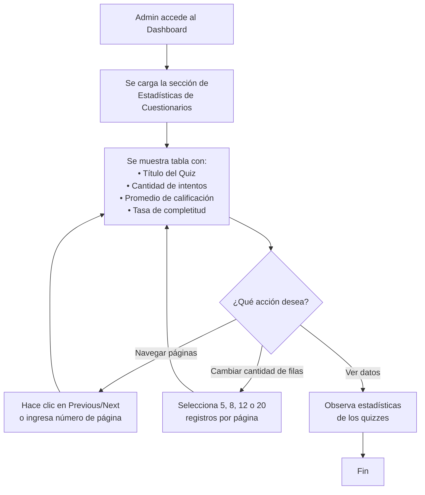
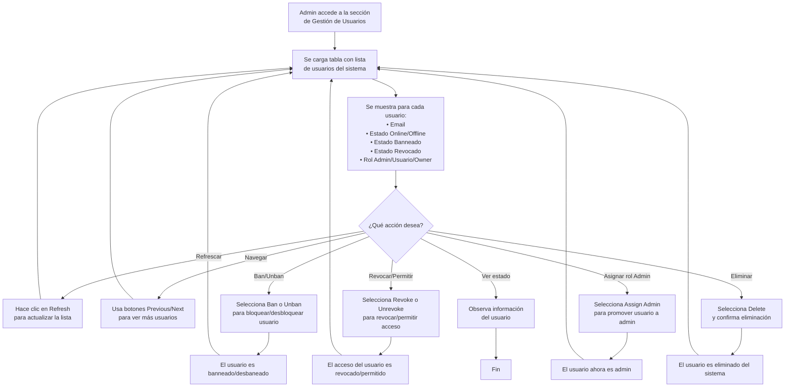
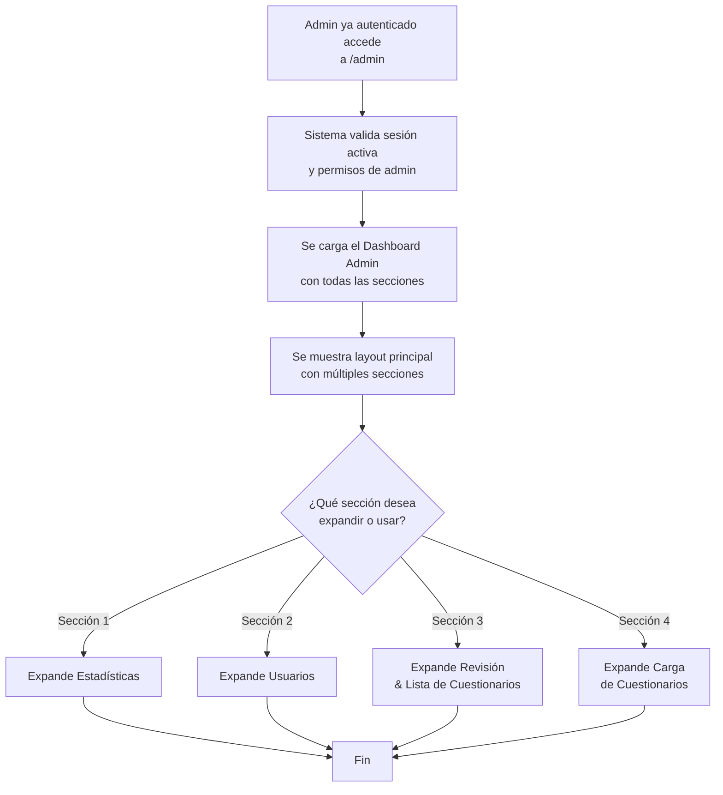
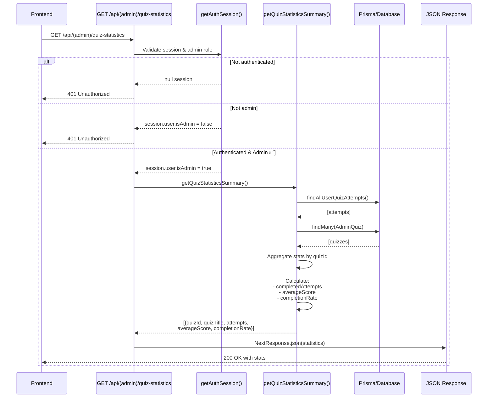
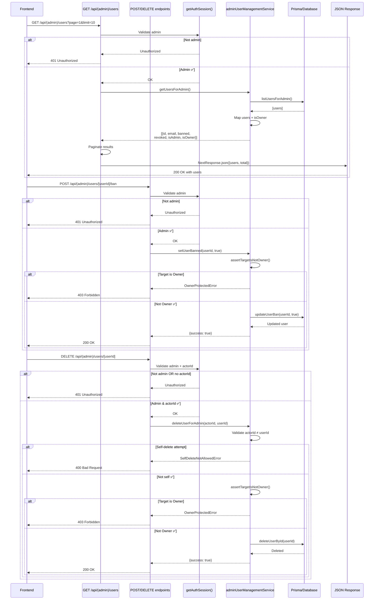
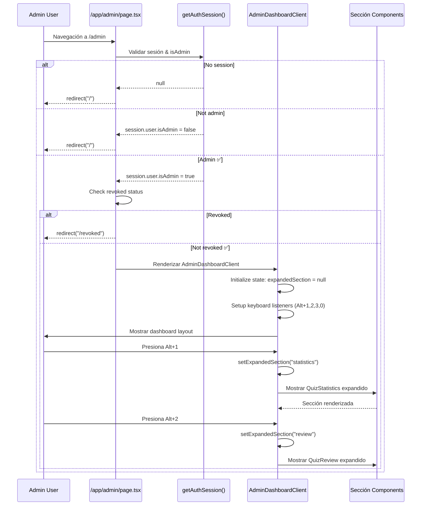

# SPRINT 5: Panel de Control Admin

## Objetivo

Sprint 5 enfoca el desarrollo del **Panel de Control Administrativo** (Admin Dashboard), un espacio centralizado donde los administradores pueden supervisar y gestionar todos los aspectos de la plataforma. Incluye tres funcionalidades principales:

1. **Ver Estadísticas de Cuestionarios** - Tabla con métricas de desempeño de quizzes
2. **Gestionar Usuarios** - Control de permisos, bans, revocaciones, eliminaciones
3. **Panel Principal** - Interfaz unificada que consolida todas las herramientas admin

---

## Plan de Historias de Usuario (HUs)

| **ID** | **Título** | **Prioridad** | **Descripción Breve** |
|--------|-----------|---------------|----------------------|
| HU17 | Ver Estadísticas de Cuestionarios | 1 | Admin visualiza tabla con intentos, promedios y tasas de completitud de todos los quizzes |
| HU18 | Gestionar Usuarios | 2 | Admin realiza acciones sobre usuarios: ban, revoke, assign admin, delete |
| HU16 | Panel de Control Admin | 3 | Admin accede a dashboard centralizado con múltiples secciones expandibles |

---

## Plan de Historias Técnicas (HTs)

| **ID** | **Título Técnico** | **Prioridad** | **Descripción** |
|--------|-------------------|---------------|-----------------|
| HT17 | Obtener Estadísticas de Quizzes | 1 | GET `/api/(admin)/quiz-statistics` con agregaciones de intentos, promedio y completitud |
| HT18 | Listar Usuarios y Gestionar Permisos | 2 | GET `/api/(admin)/users` + POST/DELETE para ban, revoke, assign-admin, delete |
| HT16 | Cargar Dashboard Admin con Navegación | 3 | Montar layout principal con secciones expandibles usando atajos de teclado |

---

---

# HISTORIAS DE USUARIO

---

## HU17 - Ver Estadísticas de Cuestionarios

### Activity Diagram



### Narrative

Un administrador accede al panel de control y visualiza la sección de Estadísticas de Cuestionarios. La tabla muestra todos los quizzes publicados con información clave sobre su uso: el título del quiz, el número total de intentos realizados por los usuarios, el promedio de calificaciones obtenidas, y el porcentaje de completitud (qué porcentaje de intentos fueron completados).

El administrador puede navegar entre páginas usando los botones Previous/Next o ingresando directamente el número de página deseado. También puede ajustar cuántos registros desea ver por página (5, 8, 12 o 20 filas), y esta preferencia se recuerda para futuras visitas.

De esta forma, el administrador obtiene una visión general del desempeño de los cuestionarios en la plataforma.

---

## HU18 - Gestionar Usuarios

### Activity Diagram



### Narrative

Un administrador accede a la sección de Gestión de Usuarios y visualiza una tabla con todos los usuarios registrados en la plataforma. Para cada usuario se muestra su correo electrónico, si está actualmente en línea u offline, si está banneado o activo, si su acceso está revocado o permitido, y su rol en el sistema (Owner, Admin, o Usuario regular).

El administrador puede realizar varias acciones sobre cada usuario: bannearlo para bloquearlo de la plataforma, revocar su acceso (medida más suave que el ban), asignarle permisos de administrador si lo necesita, o eliminarlo completamente del sistema. También puede deshacer cualquiera de estas acciones (unban, unrevoke).

La tabla es paginable, y el administrador puede refrescar la lista en cualquier momento para ver cambios recientes. El propietario del sistema (Owner) está protegido y no puede ser modificado por otros administradores.

---

## HU16 - Panel de Control Admin

### Activity Diagram



### Narrative

Un administrador autenticado accede a la sección de administración (/admin). El sistema carga un Panel de Control centralizado que consolida todas las herramientas administrativas de la plataforma.

El dashboard se presenta como un único espacio con múltiples secciones, cada una representada como un bloque que puede ser expandido o colapsado según lo que el administrador necesite en el momento. El administrador puede alternar entre secciones usando atajos de teclado o controles visuales, sin necesidad de saltar entre páginas diferentes.

De esta forma, todas las funciones de administración están disponibles en un único lugar: supervisar estadísticas, gestionar usuarios, revisar nuevo contenido, y cargar cuestionarios, permitiendo un flujo de trabajo eficiente y centralizado.

---

---

# HISTORIAS TÉCNICAS

---

## HT17 - Obtener Estadísticas de Quizzes

### Descripción Técnica

Este technical story implementa un endpoint GET que agrega estadísticas de desempeño de todos los cuestionarios publicados. El endpoint calcula tres métricas clave por quiz: número total de intentos completados, promedio de calificaciones, y tasa de completitud (porcentaje de intentos completados vs. total de intentos). Valida que el usuario sea administrador antes de acceder a los datos y utiliza agregaciones en base de datos para optimizar el rendimiento.

---

### Sequence Diagram



---

### Fases Narrativas (12 Fases)

**Fase 1: Validación de Autenticación**  
El route handler recibe la solicitud GET y extrae la sesión del usuario utilizando `getAuthSession()`. Si no hay sesión o la sesión es null, el endpoint retorna 401 Unauthorized sin procesar.

**Fase 2: Validación de Rol Admin**  
Se verifica que `session.user.isAdmin` sea true. Si el usuario está autenticado pero no es administrador, se retorna 401 Unauthorized. Solo los administradores pueden acceder a estadísticas globales.

**Fase 3: Invocación de Servicio**  
Se invoca `getQuizStatisticsSummary()` del `adminQuizService`, que es responsable de toda la lógica de agregación. El servicio no recibe parámetros, ya que calcula estadísticas para TODOS los quizzes.

**Fase 4: Obtención de Intentos Completados**  
El servicio ejecuta `findAllUserQuizAttempts()` para recuperar todos los intentos de quiz de todos los usuarios. Esta consulta retorna un array con campos: `quizId`, `status`, `score`, `quizTitle`.

**Fase 5: Validación de Quizzes Existentes**  
Se ejecuta `prisma.adminQuiz.findMany()` para obtener TODOS los quizzes que existen en la base de datos, incluyendo su `id` y `title`. Esto permite identificar si algún intento hace referencia a un quiz que fue eliminado.

**Fase 6: Construcción de Mapa de Identidad**  
Se crea un Set con todos los IDs de quizzes existentes y un Map que relaciona `quizId` → `quizTitle`. Esto optimiza las búsquedas posteriores a O(1) en lugar de O(n).

**Fase 7: Inicialización de Estructura de Datos**  
Se crea un objeto `statsMap` (Record) donde cada clave es `quizId` y el valor contiene: `quizId`, `quizTitle`, `attempts` (total), `completedAttempts`, `totalScore`.

**Fase 8: Iteración de Intentos**  
Se itera sobre cada intento obtenido en Fase 4. Para cada intento: se valida que el `quizId` exista en la base de datos actual (saltando intentos de quizzes eliminados).

**Fase 9: Agregación por Quiz**  
Si el `quizId` no existe aún en `statsMap`, se crea una nueva entrada. Se incrementa el contador de `attempts` (todos los intentos, pending y completed).

**Fase 10: Cálculo de Intentos Completados**  
Se valida si `attempt.status === "completed"`. Si es true, se incrementa `completedAttempts` y se suma el `score` a `totalScore`. Los intentos pending se cuentan en `attempts` pero NO en `completedAttempts`.

**Fase 11: Cálculo de Métricas Finales**  
Se mapea `statsMap` a un array de resultados. Para cada estadística:
- `attempts` = `completedAttempts` (solo se reportan completados como "intentos")
- `averageScore` = `totalScore / completedAttempts` redondeado a 2 decimales (0 si no hay completados)
- `completionRate` = `(completedAttempts / attempts_total) * 100` en porcentaje entero

**Fase 12: Serialización y Respuesta**  
Se retorna el array de estadísticas como JSON con status 200. El Frontend recibe la respuesta lista para renderizar en la tabla.

---

### Código Verificado

**Route Handler** — [src/app/api/(admin)/quiz-statistics/route.ts](src/app/api/(admin)/quiz-statistics/route.ts)

```typescript
import { NextResponse } from "next/server";
import { getAuthSession } from "@/server/core/auth";
import { getQuizStatisticsSummary } from "@/server/admin/services/adminQuizService";

export async function GET(req: Request) {
  const session = await getAuthSession(req);
  if (!session?.user?.isAdmin) {
    return NextResponse.json({ error: "Unauthorized" }, { status: 401 });
  }
  const statistics = await getQuizStatisticsSummary();

  return NextResponse.json(statistics, { status: 200 });
}
```

**Service — getQuizStatisticsSummary()** — [src/server/admin/services/adminQuizService.ts](src/server/admin/services/adminQuizService.ts) (líneas 163-216)

```typescript
export async function getQuizStatisticsSummary() {
  const attempts = await findAllUserQuizAttempts();

  // Get all existing quiz IDs
  const existingQuizzes = await prisma.adminQuiz.findMany({
    select: {
      id: true,
      title: true,
    },
  });

  const existingQuizIds = new Set(existingQuizzes.map((q) => q.id));
  const quizIdToTitle = new Map(existingQuizzes.map((q) => [q.id, q.title]));

  const statsMap: Record<
    string,
    {
      quizId: string;
      quizTitle: string;
      attempts: number;
      completedAttempts: number;
      totalScore: number;
    }
  > = {};

  for (const attempt of attempts) {
    // Skip attempts for deleted quizzes
    if (!existingQuizIds.has(attempt.quizId)) {
      continue;
    }

    if (!statsMap[attempt.quizId]) {
      statsMap[attempt.quizId] = {
        quizId: attempt.quizId,
        quizTitle: quizIdToTitle.get(attempt.quizId) || attempt.quizTitle,
        attempts: 0,
        completedAttempts: 0,
        totalScore: 0,
      };
    }

    statsMap[attempt.quizId].attempts += 1;
    if (attempt.status === "completed") {
      statsMap[attempt.quizId].completedAttempts += 1;
      statsMap[attempt.quizId].totalScore += attempt.score || 0;
    }
  }

  return Object.values(statsMap).map((data) => ({
    quizId: data.quizId,
    quizTitle: data.quizTitle,
    attempts: data.completedAttempts,
    averageScore:
      data.completedAttempts > 0
        ? Math.round((data.totalScore / data.completedAttempts) * 100) / 100
        : 0,
    completionRate:
      data.attempts > 0
        ? Math.round((data.completedAttempts / data.attempts) * 100)
        : 0,
  }));
}
```

**Tipos de Respuesta**

```typescript
type QuizStatistic = {
  quizId: string;
  quizTitle: string;
  attempts: number;                    // Completed attempts
  averageScore: number;                // Average of scores (0-100)
  completionRate: number;              // Percentage (0-100)
};

// Response: QuizStatistic[]
```

---

## HT18 - Listar Usuarios y Gestionar Permisos

### Descripción Técnica

Este technical story implementa un conjunto de endpoints para listar usuarios del sistema y ejecutar acciones administrativas sobre ellos. El endpoint principal GET retorna todos los usuarios con información de estado (ban, revoke, role). Los endpoints de acción (POST/DELETE) permiten al administrador banear, revocar, promover a admin o eliminar usuarios. Todas las operaciones validan permisos de admin, protegen la cuenta Owner, y previenen auto-eliminación. Las operaciones sensibles lanzan excepciones específicas que mapean a códigos HTTP apropiedos.

---

### Sequence Diagram



---

### Fases Narrativas (15 Fases)

**Fase 1: Validación de Autenticación (GET)**  
El Frontend ejecuta GET `/api/(admin)/users` con parámetros de paginación (page, limit). El route handler extrae la sesión del usuario usando `getAuthSession()`. Si no hay sesión o es null, retorna 401 Unauthorized sin procesar.

**Fase 2: Validación de Rol Admin (GET)**  
Se verifica que `session.user.isAdmin` sea true. Si el usuario está autenticado pero no es administrador, se retorna 401 Unauthorized. Solo administradores pueden acceder a la lista de usuarios.

**Fase 3: Invocación de Servicio (GET)**  
Se invoca `getUsersForAdmin()` del `adminUserManagementService`, que es responsable de obtener y enriquecer los datos de usuarios con información de rol Owner.

**Fase 4: Obtención de Lista de Usuarios**  
El servicio ejecuta `listUsersForAdmin()` que realiza una consulta a Prisma para obtener todos los usuarios con campos: id, email, name, banned, revoked, isAdmin, lastSeen.

**Fase 5: Enriquecimiento de Datos**  
Para cada usuario obtenido, se ejecuta `isOwnerEmail(user.email)` para determinar si es la cuenta Owner (basado en una configuración). Se agrega el campo `isOwner: boolean` a cada usuario en el array.

**Fase 6: Paginación de Resultados (GET)**  
El route handler extrae `page` y `limit` de searchParams (defaults: page=1, limit=10). Calcula `start = (page - 1) * limit` y obtiene un slice del array: `users.slice(start, start + limit)`.

**Fase 7: Serialización de Respuesta (GET)**  
Se retorna un JSON con estructura `{ users: [...], total: number }`. El total es la cantidad completa de usuarios sin paginar, permitiendo al Frontend calcular el número de páginas.

**Fase 8: Validación Pre-Acción (POST/DELETE)**  
Para operaciones de acción (ban, revoke, assign-admin, delete), el route handler valida autenticación y rol admin nuevamente. Si no es admin, retorna 401 Unauthorized.

**Fase 9: Protección de Cuenta Owner (POST ban/revoke/assign-admin)**  
Antes de ejecutar cualquier acción sobre un usuario, se llama `assertTargetIsNotOwner(userId)`. Esta función busca el usuario en BD y verifica su email contra la lista de Owner. Si es Owner, lanza `OwnerProtectedError`.

**Fase 10: Manejo de OwnerProtectedError (POST)**  
Si se lanza `OwnerProtectedError`, el route handler la captura y retorna 403 Forbidden con mensaje "Owner account is protected." El Owner no puede ser modificado por otro admin.

**Fase 11: Validación de Auto-Eliminación (DELETE)**  
Para DELETE, se compara `actorUserId === targetUserId`. Si son iguales (el admin intenta eliminar su propia cuenta), se lanza `SelfDeleteNotAllowedError`.

**Fase 12: Manejo de SelfDeleteNotAllowedError (DELETE)**  
Si se lanza `SelfDeleteNotAllowedError`, el route handler la captura y retorna 400 Bad Request con mensaje "You cannot delete your own account." Previene que un admin se auto-elimine accidentalmente.

**Fase 13: Ejecución de Acción en BD (POST/DELETE)**  
Si todas las validaciones pasan, se ejecuta la acción correspondiente:
- Ban: `updateUserBan(userId, true)` → `banned = true`
- Unban: `updateUserBan(userId, false)` → `banned = false`
- Revoke: `updateUserRevoke(userId, true)` → `revoked = true`
- Unrevoke: `updateUserRevoke(userId, false)` → `revoked = false`
- Assign Admin: `updateUserAdmin(userId, true)` → `isAdmin = true`
- Delete: `deleteUserById(userId)` → elimina el usuario completamente

**Fase 14: Persistencia**  
Prisma ejecuta la query UPDATE o DELETE en la base de datos. La transacción es confirmada y el usuario modificado es retornado.

**Fase 15: Respuesta de Éxito**  
Se retorna un JSON con `{ success: true }` y status 200. El Frontend puede entonces refrescar la lista de usuarios para ver los cambios reflejados, o actualizar el estado local optimistically.

---

### Código Verificado

**GET Route Handler** — [src/app/api/(admin)/users/route.ts](src/app/api/(admin)/users/route.ts)

```typescript
import { NextResponse } from "next/server";
import { getAuthSession } from "@/server/core/auth";
import { getUsersForAdmin } from "@/server/admin/services/adminUserManagementService";

export async function GET(req: Request) {
  const session = await getAuthSession(req);
  if (!session?.user?.isAdmin) {
    return NextResponse.json({ error: "Unauthorized" }, { status: 401 });
  }

  const { searchParams } = new URL(req.url);
  const page = parseInt(searchParams.get("page") ?? "1", 10) || 1;
  const limit = parseInt(searchParams.get("limit") ?? "10", 10) || 10;

  const users = await getUsersForAdmin();
  const total = Array.isArray(users) ? users.length : 0;
  const start = (page - 1) * limit;
  const pageItems = Array.isArray(users) ? users.slice(start, start + limit) : [];

  return NextResponse.json({ users: pageItems, total });
}
```

**Ban User** — [src/app/api/(admin)/users/[userId]/ban/route.ts](src/app/api/(admin)/users/[userId]/ban/route.ts)

```typescript
import { NextRequest, NextResponse } from "next/server";
import { getAuthSession } from "@/server/core/auth";
import {
  OwnerProtectedError,
  setUserBanned,
} from "@/server/admin/services/adminUserManagementService";

export async function POST(
  req: NextRequest,
  { params }: { params: Promise<{ userId: string }> },
) {
  const { userId } = await params;
  const session = await getAuthSession(req);
  if (!session?.user?.isAdmin) {
    return NextResponse.json({ error: "Unauthorized" }, { status: 401 });
  }
  try {
    await setUserBanned(userId, true);
    return NextResponse.json({ success: true });
  } catch (error) {
    if (error instanceof OwnerProtectedError) {
      return NextResponse.json({ error: error.message }, { status: 403 });
    }
    return NextResponse.json({ error: "Failed to ban user" }, { status: 500 });
  }
}
```

**Service Layer** — [src/server/admin/services/adminUserManagementService.ts](src/server/admin/services/adminUserManagementService.ts)

```typescript
import {
  deleteUserById,
  findUserIdentityById,
  updateUserAdmin,
  updateUserBan,
  updateUserRevoke,
  listUsersForAdmin,
} from "@/server/repositories/userRepository";
import { isOwnerEmail } from "@/server/core/roles";

export class OwnerProtectedError extends Error {
  constructor() {
    super("Owner account is protected.");
    this.name = "OwnerProtectedError";
  }
}

export class SelfDeleteNotAllowedError extends Error {
  constructor() {
    super("You cannot delete your own account.");
    this.name = "SelfDeleteNotAllowedError";
  }
}

async function assertTargetIsNotOwner(userId: string) {
  const user = await findUserIdentityById(userId);
  if (user && isOwnerEmail(user.email)) {
    throw new OwnerProtectedError();
  }
}

export async function getUsersForAdmin() {
  const users = await listUsersForAdmin();
  return users.map((user) => ({
    ...user,
    isOwner: isOwnerEmail(user.email),
  }));
}

export async function setUserBanned(userId: string, banned: boolean) {
  await assertTargetIsNotOwner(userId);
  return updateUserBan(userId, banned);
}

export async function setUserRevoked(userId: string, revoked: boolean) {
  await assertTargetIsNotOwner(userId);
  return updateUserRevoke(userId, revoked);
}

export async function setUserAdmin(userId: string, isAdmin: boolean) {
  await assertTargetIsNotOwner(userId);
  return updateUserAdmin(userId, isAdmin);
}

export async function deleteUserForAdmin(actorUserId: string, targetUserId: string) {
  if (actorUserId === targetUserId) {
    throw new SelfDeleteNotAllowedError();
  }
  await assertTargetIsNotOwner(targetUserId);
  return deleteUserById(targetUserId);
}
```

**Tipos de Respuesta**

```typescript
// GET Response
type GetUsersResponse = {
  users: Array<{
    id: string;
    email: string;
    name?: string | null;
    banned?: boolean;
    revoked?: boolean;
    isAdmin?: boolean;
    isOwner?: boolean;
    lastSeen?: string;
  }>;
  total: number;
};

// Action Response
type ActionResponse = {
  success: true;
};
```

---

## HT16 - Cargar Dashboard Admin con Navegación

### Descripción Técnica

Este technical story implementa el layout principal del Dashboard Admin que consolida múltiples secciones (Estadísticas, Usuarios, Revisión de Cuestionarios, Carga de Cuestionarios) en una interfaz unificada. El dashboard carga los componentes de forma lazy y permite alternar entre secciones usando atajos de teclado (Alt+1, Alt+2, Alt+3, Alt+0) o controles visuales. Cada sección puede ser expandida o colapsada sin navegar a una nueva página.

---

### Sequence Diagram



---

### Fases Narrativas (11 Fases)

**Fase 1: Acceso a la Página Admin**  
El administrador navega a `/app/admin` usando la navegación de la aplicación. El servidor ejecuta el componente Server `AdminPage` que valida la sesión antes de renderizar.

**Fase 2: Extracción de Sesión**  
Se invoca `getAuthSession()` de forma asíncrona en el servidor. Si retorna null (no autenticado), se ejecuta `redirect("/")` y el usuario es redirigido a la página principal.

**Fase 3: Validación de Permisos Admin**  
Se verifica que `session?.user?.isAdmin` sea true. Si el usuario está autenticado pero no es administrador, se ejecuta `redirect("/")` y se lo redirige fuera de la sección admin.

**Fase 4: Validación de Estado Revocado**  
Se extrae `session.user.id` y se invoca `getUserRevokedStatus(userId)` para verificar si la cuenta está revocada. Si es true, se ejecuta `redirect("/revoked")`.

**Fase 5: Renderización de Cliente**  
Si todas las validaciones pasan, se renderiza el componente cliente `AdminDashboardClient`. Este componente configura state, listeners, y la interfaz interactiva.

**Fase 6: Inicialización de Estado**  
El componente inicializa `expandedSection: null` (todas las secciones colapsadas) y `quizToReview: null`. También carga `quizListRefreshKey` para forzar re-renders cuando sea necesario.

**Fase 7: Configuración de Atajos de Teclado**  
Se registra un listener `keydown` global que captura combinaciones Alt+1, Alt+2, Alt+3, Alt+0:
- Alt+1 → `setExpandedSection("statistics")`
- Alt+2 → `setExpandedSection("review")`
- Alt+3 → `setExpandedSection("users")`
- Alt+0 → `setExpandedSection(null)` (collapsar todo)

**Fase 8: Renderización del Layout Principal**  
Se renderiza un grid o flex layout con múltiples tarjetas. Cada tarjeta representa una sección:
- **Sección 1**: QuizStatistics (si `expandedSection === "statistics"`, usa `compact={false}`, sino `compact={true}`)
- **Sección 2**: QuizReview + QuizList
- **Sección 3**: UserManagement
- **Sección 4**: QuizUpload

**Fase 9: Props Dinámicos (Compact Mode)**  
Cada componente de sección recibe una prop `compact` que determina su visualización:
- Si es la sección expandida: `compact={false}` (altura completa, encabezado visible)
- Si no es expandida: `compact={true}` (altura reducida, solo tabla)

**Fase 10: Interacción del Usuario con Secciones**  
El admin puede:
- Presionar Alt+1, Alt+2, Alt+3 para expandir secciones
- Presionar Alt+0 para colapsarlas todas
- O hacer clic en botones visuales (si están implementados) para expandir/colapsar

**Fase 11: Persistencia de UI**  
El estado de `expandedSection` se mantiene en memoria mientras el admin esté en la página. Si recarga o navega afuera, vuelve a inicializarse en null.

---

### Código Verificado

**Server Component** — [src/app/admin/page.tsx](src/app/admin/page.tsx)

```typescript
import { redirect } from "next/navigation";
import AdminDashboardClient from "@/components/admin/AdminDashboardClient";
import { getAuthSession } from "@/server/core/auth";
import { getUserRevokedStatus } from "@/server/services/userReadService";

const AdminPage = async () => {
  const session = await getAuthSession();
  if (!session?.user?.isAdmin) {
    redirect("/");
  }
  
  // Check if user is revoked
  if (session.user.id) {
    const isRevoked = await getUserRevokedStatus(session.user.id);
    if (isRevoked) {
      redirect("/revoked");
    }
  }
  
  return <AdminDashboardClient />;
};

export default AdminPage;
```

**Client Component** — [src/components/admin/AdminDashboardClient.tsx](src/components/admin/AdminDashboardClient.tsx) (fragmento)

```typescript
"use client";
import React, { useEffect, useState } from "react";
import QuizUpload from "@/components/admin/QuizUpload";
import QuizReview from "@/components/admin/QuizReview";
import QuizList from "@/components/admin/QuizList";
import QuizStatistics from "@/components/admin/QuizStatistics";
import UserManagement from "@/components/admin/UserManagement";

type ExpandedSection = "statistics" | "review" | "users" | null;

const AdminDashboardClient = () => {
  const [expandedSection, setExpandedSection] = useState<ExpandedSection>(null);
  const [quizListRefreshKey, setQuizListRefreshKey] = useState(0);

  useEffect(() => {
    const onKeyDown = (event: KeyboardEvent) => {
      if (!event.altKey || event.ctrlKey || event.metaKey) {
        return;
      }

      if (event.key === "1") {
        event.preventDefault();
        setExpandedSection("statistics");
        return;
      }

      if (event.key === "2") {
        event.preventDefault();
        setExpandedSection("review");
        return;
      }

      if (event.key === "3") {
        event.preventDefault();
        setExpandedSection("users");
        return;
      }

      if (event.key === "0") {
        event.preventDefault();
        setExpandedSection(null);
      }
    };

    window.addEventListener("keydown", onKeyDown);
    return () => window.removeEventListener("keydown", onKeyDown);
  }, []);

  return (
    <div className="space-y-4 p-4">
      <QuizStatistics compact={expandedSection !== "statistics"} />
      <UserManagement compact={expandedSection !== "users"} />
      <QuizReview compact={expandedSection !== "review"} />
      <QuizList compact={expandedSection !== "review"} refreshKey={quizListRefreshKey} />
      <QuizUpload onQuizReady={handleQuizReady} />
    </div>
  );
};

export default AdminDashboardClient;
```

---

---

# ENDPOINTS

---

## 1. GET /api/(admin)/quiz-statistics

**Descripción:** Obtiene estadísticas agregadas de todos los cuestionarios publicados.

**Autenticación:** Admin requerido (`session.user.isAdmin === true`)

**Parámetros:** Ninguno

**Respuesta (200 OK):**
```json
[
  {
    "quizId": "uuid-string",
    "quizTitle": "FENW_Angular_Eng.pdf",
    "attempts": 20,
    "averageScore": 85.5,
    "completionRate": 100
  }
]
```

**Errores:**
- `401 Unauthorized` - Usuario no es admin

---

## 2. GET /api/(admin)/users

**Descripción:** Lista todos los usuarios del sistema con paginación.

**Autenticación:** Admin requerido

**Parámetros Query:**
- `page` (optional, default: 1) - Número de página
- `limit` (optional, default: 10) - Registros por página

**Respuesta (200 OK):**
```json
{
  "users": [
    {
      "id": "user-id-1",
      "email": "admin@example.com",
      "name": "Admin Name",
      "banned": false,
      "revoked": false,
      "isAdmin": true,
      "isOwner": true,
      "lastSeen": "2026-06-27T10:30:00Z"
    }
  ],
  "total": 150
}
```

**Errores:**
- `401 Unauthorized` - Usuario no es admin

---

## 3. POST /api/(admin)/users/[userId]/ban

**Descripción:** Banea un usuario (lo bloquea del sistema).

**Autenticación:** Admin requerido

**Parámetros:**
- `userId` (path) - ID del usuario a banear

**Body:** Empty

**Respuesta (200 OK):**
```json
{
  "success": true
}
```

**Errores:**
- `401 Unauthorized` - Usuario no es admin
- `403 Forbidden` - El usuario objetivo es el Owner
- `500 Internal Server Error` - Error al actualizar

---

## 4. POST /api/(admin)/users/[userId]/unban

**Descripción:** Desbanea un usuario (lo reactiva).

**Autenticación:** Admin requerido

**Parámetros:**
- `userId` (path) - ID del usuario a desbanear

**Body:** Empty

**Respuesta (200 OK):**
```json
{
  "success": true
}
```

**Errores:**
- `401 Unauthorized` - Usuario no es admin
- `403 Forbidden` - El usuario objetivo es el Owner
- `500 Internal Server Error` - Error al actualizar

---

## 5. POST /api/(admin)/users/[userId]/revoke

**Descripción:** Revoca el acceso de un usuario (medida más suave que ban).

**Autenticación:** Admin requerido

**Parámetros:**
- `userId` (path) - ID del usuario a revocar

**Body:** Empty

**Respuesta (200 OK):**
```json
{
  "success": true
}
```

**Errores:**
- `401 Unauthorized` - Usuario no es admin
- `403 Forbidden` - El usuario objetivo es el Owner
- `404 Not Found` - Usuario no existe
- `500 Internal Server Error` - Error al actualizar

---

## 6. POST /api/(admin)/users/[userId]/unrevoke

**Descripción:** Permite el acceso de un usuario revocado.

**Autenticación:** Admin requerido

**Parámetros:**
- `userId` (path) - ID del usuario a permitir

**Body:** Empty

**Respuesta (200 OK):**
```json
{
  "success": true
}
```

**Errores:**
- `401 Unauthorized` - Usuario no es admin
- `403 Forbidden` - El usuario objetivo es el Owner
- `500 Internal Server Error` - Error al actualizar

---

## 7. POST /api/(admin)/users/[userId]/assign-admin

**Descripción:** Promociona un usuario a administrador.

**Autenticación:** Admin requerido

**Parámetros:**
- `userId` (path) - ID del usuario a promocionar

**Body:** Empty

**Respuesta (200 OK):**
```json
{
  "success": true,
  "user": {
    "id": "user-id",
    "email": "user@example.com",
    "isAdmin": true
  }
}
```

**Errores:**
- `401 Unauthorized` - Usuario no es admin
- `400 Bad Request` - userId faltante
- `403 Forbidden` - El usuario objetivo es el Owner
- `500 Internal Server Error` - Error al actualizar

---

## 8. DELETE /api/(admin)/users/[userId]

**Descripción:** Elimina un usuario del sistema.

**Autenticación:** Admin requerido

**Parámetros:**
- `userId` (path) - ID del usuario a eliminar

**Body:** Empty

**Respuesta (200 OK):**
```json
{
  "success": true
}
```

**Errores:**
- `401 Unauthorized` - Usuario no es admin
- `400 Bad Request` - Admin intenta auto-eliminarse
- `403 Forbidden` - El usuario objetivo es el Owner
- `500 Internal Server Error` - Error al eliminar

---

**Fin de Sprint 5**
