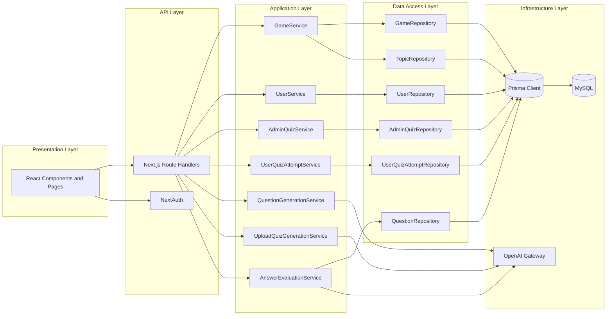
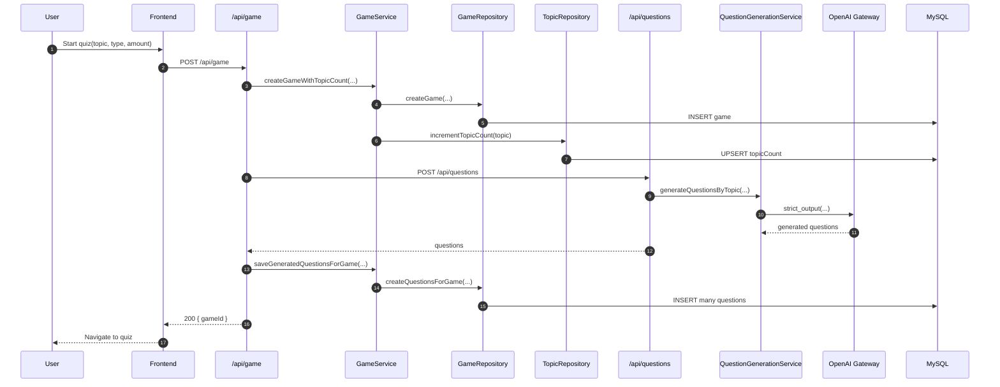
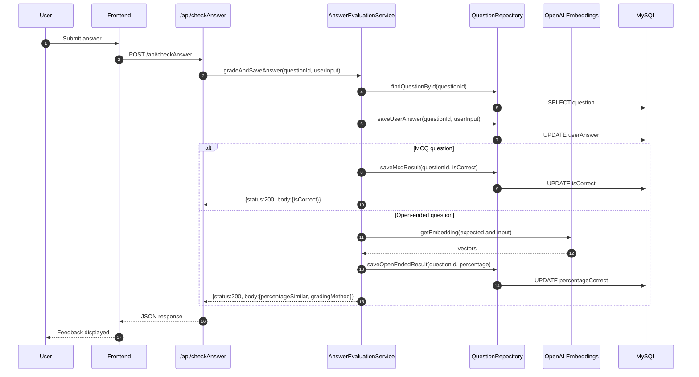
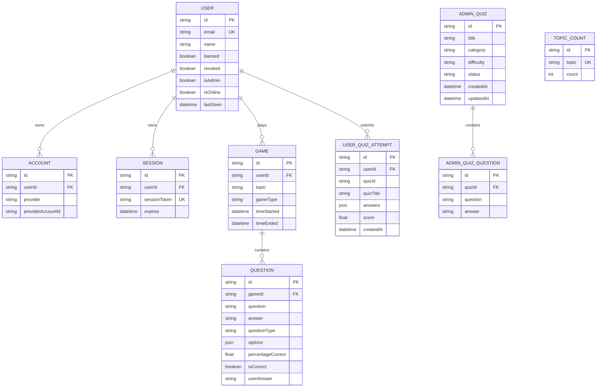

# Layered Architecture, Tests, and UML

This document summarizes the project architecture and the verification strategy used for TFM.

## Folder Organization

The backend logic is now organized under a dedicated server tree:

```text
src/
  server/
    core/
      auth.ts
      db.ts
    ai/
      gpt.ts
      gptadmin.ts
      openaiClient.ts
      experimental/
        gpttest.ts
        gptadmintest.ts
    repositories/
      adminQuizRepository.ts
      gameRepository.ts
      questionRepository.ts
      topicRepository.ts
      userQuizAttemptRepository.ts
      userRepository.ts
    services/
      adminQuizService.ts
      answerEvaluationService.ts
      gameService.ts
      questionGenerationService.ts
      uploadQuizGenerationService.ts
      userQuizAttemptService.ts
      userService.ts
    question-generation/
      generateQuestions.ts
      parseAndGenerateQuestions.ts
```

Compatibility shim files remain in src/lib so existing imports keep working while migration is completed.

## Layered Architecture



## Sequence Diagram: Quiz Creation



## Sequence Diagram: Answer Evaluation



## ER Diagram



## Test Strategy by Layer

1. API route tests: Validate auth, validation, status codes, and response payload shape.
2. Service tests: Validate orchestration, business rules, and aggregation logic.
3. Repository tests: Validate Prisma query shape and persistence contracts.
4. Architecture tests: Enforce layer boundaries to prevent direct route->db and service->db coupling.

## Current Test Files Added

1. Route tests: endGame, setAdmin, auth route wrapper.
2. Service tests: adminQuizService, gameService, userService, userQuizAttemptService, questionGenerationService, uploadQuizGenerationService.
3. Repository tests: adminQuizRepository, gameRepository, questionRepository, topicRepository, userRepository, userQuizAttemptRepository.
4. Architecture test: layering import rules.
